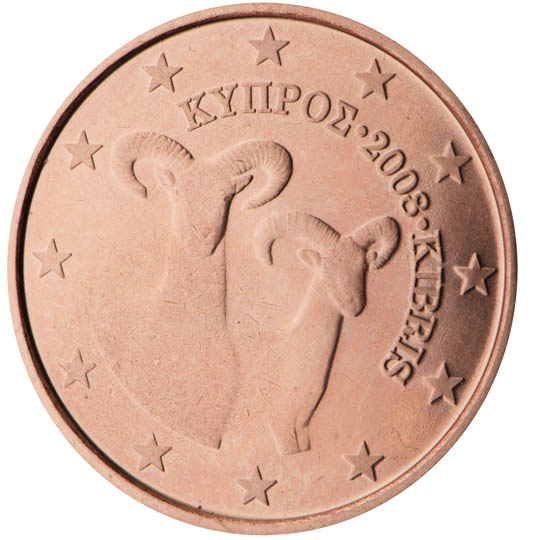

# Cyprus € 0.05

## Images

## Metadata

**Country:** [Cyprus](../index.md)\
**Serie:** [Cyprus 2008 - ...](index.md)\
**Monetary value:** € 0.05\
**Currency:** Euro

## Description

## Mintages

| Year | Mintmark | Circulated | Brilliant Uncirculated | Proof |
| ---- | -------- | ---------- | ---------------------- | ----- |
| 2008 |  | 60000000| 70000 |  |
| 2009 |  | 6000000| 15000 |  |
| 2010 |  | 200000| 0 |  |
| 2011 |  | 30210000| 10000 |  |
| 2012 |  | 1000000| 12000 |  |
| 2013 |  | 100000| 10000 |  |
| 2014 |  | 100000| 7000 |  |
| 2015 |  | 100000| 7000 |  |
| 2016 |  | 100000| 7000 |  |
| 2017 |  | 100000| 5000 |  |
| 2018 |  | 14100000| 5000 |  |
| 2019 |  | 8100000| 5000 |  |
| 2020 |  | 7505000| 5000 |  |
| 2021 |  | 0 | 0 | 0 |
| 2022 |  | 0 | 0 | 0 |
| 2023 |  | 0 | 0 | 0 |
| 2024 |  | 0 | 0 | 0 |
