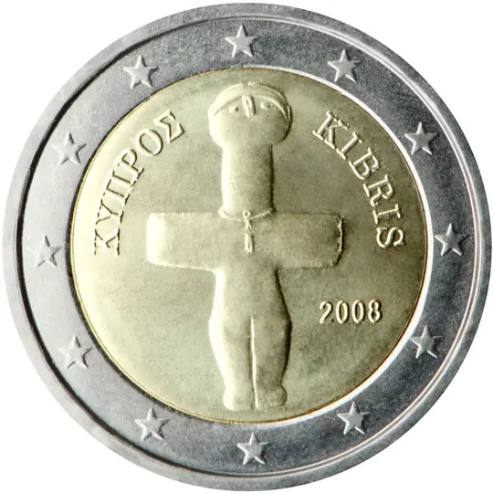

# Cyprus € 2.00

## Images

## Metadata

**Country:** [Cyprus](../index.md)\
**Serie:** [Cyprus 2008 - ...](index.md)\
**Monetary value:** € 2.00\
**Currency:** Euro

## Description

Idol of Pomos (3000 v. Chr.)

## Mintages

| Year | Mintmark | Circulated | Brilliant Uncirculated | Proof |
| ---- | -------- | ---------- | ---------------------- | ----- |
| 2008 |          | 25000000   | 70000                  | 0     |
| 2009 |          | 5000000    | 15000                  | 0     |
| 2010 |          | 200000     | 0                      | 0     |
| 2011 |          | 210000     | 10000                  | 0     |
| 2012 |          | 1000000    | 12000                  | 0     |
| 2013 |          | 100000     | 10000                  | 0     |
| 2014 |          | 100000     | 7000                   | 0     |
| 2015 |          | 100000     | 7000                   | 0     |
| 2016 |          | 100000     | 7000                   | 0     |
| 2017 |          | 100000     | 5000                   | 0     |
| 2018 |          | 7100000    | 5000                   | 0     |
| 2019 |          | 1400000    | 5000                   | 0     |
| 2020 |          | 3305000    | 5000                   | 0     |
| 2021 |          | 3005000    | 5000                   | 0     |
| 2022 |          | 3755000    | 5000                   | 0     |
| 2023 |          | 463000     | 5000                   | 0     |
| 2024 |          | 0          | 5000                   | 0     |
| 2025 |          | 0          | 0                      | 0     |
| 2026 |          | 0          | 0                      | 0     |
