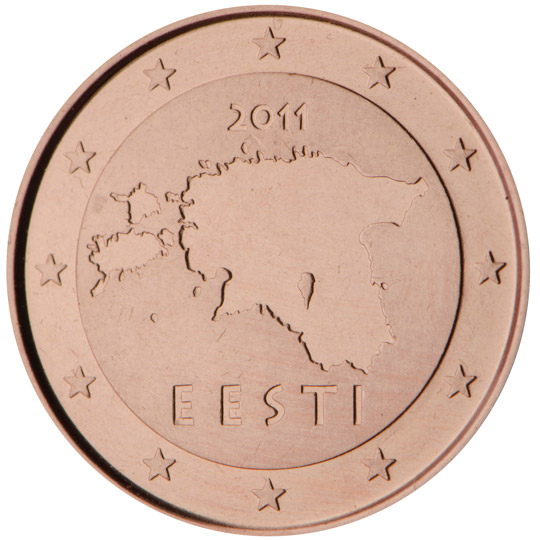

# Estonia € 0.01

## Images

## Metadata

**Country:** [Estonia](../index.md)\
**Serie:** [Estonia 2011 - ...](index.md)\
**Monetary value:** € 0.01\
**Currency:** Euro

## Description

## Mintages

| Year | Mintmark | Circulated | Brilliant Uncirculated | Proof |
| ---- | -------- | ---------- | ---------------------- | ----- |
| 2011 |  | 32000000| 50000 | 3500 |
| 2012 |  | 25000000|  |  |
| 2013 |  | |  |  |
| 2014 |  | |  |  |
| 2015 |  | 14000000|  |  |
| 2016 |  | 0| 20000 |  |
| 2017 |  | 29000000|  |  |
| 2018 |  | 500000| 5000 |  |
| 2019 |  | 10000000|  |  |
| 2020 |  | |  |  |
| 2021 |  | 0 | 0 | 0 |
| 2022 |  | 0 | 0 | 0 |
| 2023 |  | 0 | 0 | 0 |
| 2024 |  | 0 | 0 | 0 |
