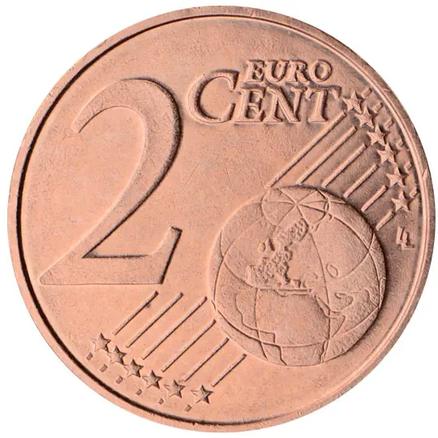
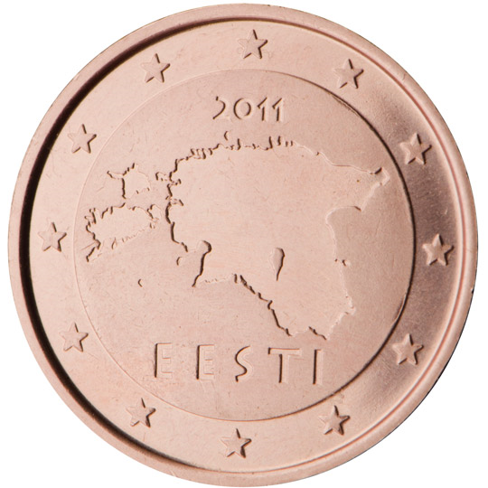

# Estonia € 0.02

## Images

## Metadata

**Country:** [Estonia](../index.md)\
**Serie:** [Estonia 2011 - ...](index.md)\
**Monetary value:** € 0.02\
**Currency:** Euro

## Description

## Mintages

| Year | Mintmark | Circulated | Brilliant Uncirculated | Proof |
| ---- | -------- | ---------- | ---------------------- | ----- |
| 2011 |          | 30000000   | 53500                  | 0     |
| 2012 |          | 25000000   | 0                      | 0     |
| 2013 |          | 0          | 0                      | 0     |
| 2014 |          | 0          | 0                      | 0     |
| 2015 |          | 17100000   | 0                      | 0     |
| 2016 |          | 0          | 20000                  | 0     |
| 2017 |          | 9000000    | 0                      | 0     |
| 2018 |          | 8500000    | 5000                   | 0     |
| 2019 |          | 0          | 0                      | 0     |
| 2020 |          | 2000000    | 0                      | 0     |
| 2021 |          | 8000000    | 0                      | 0     |
| 2022 |          | 10000000   | 7500                   | 0     |
| 2023 |          | 0          | 0                      | 0     |
| 2024 |          | 0          | 0                      | 0     |
