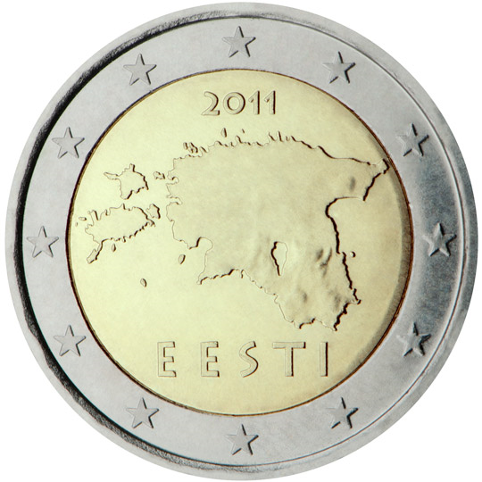

# Estonia € 2.00

## Images

## Metadata

**Country:** [Estonia](../index.md)\
**Serie:** [Estonia 2011 - ...](index.md)\
**Monetary value:** € 2.00\
**Currency:** Euro

## Description

## Mintages

| Year | Mintmark | Circulated | Brilliant Uncirculated | Proof |
| ---- | -------- | ---------- | ---------------------- | ----- |
| 2011 |          | 11000000   | 50000                  | 3500  |
| 2012 |          |            |                        |       |
| 2013 |          |            |                        |       |
| 2014 |          |            |                        |       |
| 2015 |          |            |                        |       |
| 2016 |          | 0          | 20000                  |       |
| 2017 |          |            |                        |       |
| 2018 |          | 500000     | 5000                   |       |
| 2019 |          |            |                        |       |
| 2020 |          | 1750000    |                        |       |
| 2021 |          | 0          | 0                      | 0     |
| 2022 |          | 0          | 0                      | 0     |
| 2023 |          | 0          | 0                      | 0     |
| 2024 |          | 0          | 0                      | 0     |
