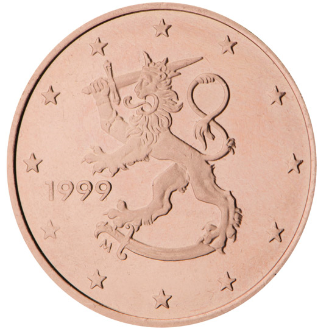

# Finland € 0.05

## Images

## Metadata

**Country:** [Finland](../index.md)\
**Serie:** [Finland 1999 - 2007](index.md)\
**Monetary value:** € 0.05\
**Currency:** Euro

## Description

## Mintages

| Year | Mintmark | Circulated | Brilliant Uncirculated | Proof |
| ---- | -------- | ---------- | ---------------------- | ----- |
| 1999 |          | 63880000          | 75000                  | 15000 |
| 2000 |          | 57160000          | 75000                  | 15000 |
| 2001 |          | 214256000          | 75000                  | 15000 |
| 2002 |          | 101824000          | 130000                 | 16000 |
| 2003 |          | 790000          | 221500                 | 14000 |
| 2004 |          | 629000          | 111500                 | 5000  |
| 2005 |          | 800000          | 86500                  | 3000  |
| 2006 |          | 1000000          | 80500                  | 3300  |
| 2007 |          | 1000000          | 72000                  | 2500  |
| 2008 |          | 1000000          | 52000                  | 2500  |
| 2009 |          | 1000000          | 52000                  | 2500  |
| 2010 |          | 800000          | 47000                  | 2000  |
| 2011 |          | 800000          | 37000                  | 2000  |
| 2012 |          | 800000          | 67000                  | 2000  |
| 2013 |          | 400000          | 62000                  | 1800  |
| 2014 |          | 13780000          | 57500                  | 1200  |
| 2015 |          | 200000          | 25500                  | 1200  |
| 2016 |          | 200000          | 20500                  | 1200  |
| 2017 |          | 10180000          | 17900                  | 1000  |
| 2018 |          | 50000          | 18000                  | 1000  |
| 2019 |          | 7980000          |                        |       |
| 2020 |          | 0          | 500                    |       |
| 2021 |          | 0          | 0                      | 0     |
| 2022 |          | 0          | 0                      | 0     |
| 2023 |          | 0          | 0                      | 0     |
| 2024 |          | 0          | 0                      | 0     |
