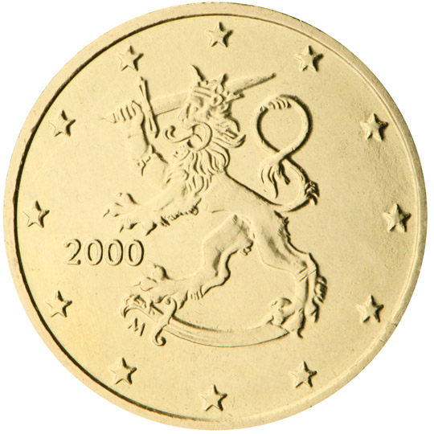

# Finland € 0.50

## Images

## Metadata

**Country:** [Finland](../index.md)\
**Serie:** [Finland 1999 - 2007](index.md)\
**Monetary value:** € 0.50\
**Currency:** Euro

## Description

Upright Lion with Sword and Crown

## Mintages

| Year | Mintmark | Circulated | Brilliant Uncirculated | Proof |
| ---- | -------- | ---------- | ---------------------- | ----- |
| 1999 |          | 20696000   | 75000                  | 15000 |
| 2000 |          | 67097000   | 75000                  | 15000 |
| 2001 |          | 4432000    | 75000                  | 15000 |
| 2002 |          | 1147000    | 133000                 | 1000  |
| 2003 |          | 790000     | 227000                 | 14500 |
| 2004 |          | 629000     | 113000                 | 5000  |
| 2005 |          | 4800000    | 84000                  | 5500  |
| 2006 |          | 6850000    | 79500                  | 3300  |
| 2007 |          | 1000000    | 84500                  | 2500  |
| 2008 |          | 8000000    | 92000                  | 2500  |
| 2009 |          | 7000000    | 62200                  | 2500  |
| 2010 |          | 800000     | 60000                  | 2000  |
| 2011 |          | 3800000    | 43000                  | 2000  |
| 2012 |          | 4800000    | 74000                  | 2000  |
| 2013 |          | 400000     | 70200                  | 2500  |
| 2014 |          | 200000     | 79700                  | 1200  |
| 2015 |          | 200000     | 36700                  | 1200  |
| 2016 |          | 200000     | 28700                  | 1200  |
| 2017 |          | 100000     | 29100                  | 1000  |
| 2018 |          | 50000      | 13500                  | 1000  |
| 2019 |          | 0          | 0                      | 0     |
| 2020 |          | 0          | 13000                  | 500   |
| 2021 |          | 0          | 13200                  | 1000  |
| 2022 |          | 0          | 15900                  | 1500  |
| 2023 |          | 0          | 12000                  | 1500  |
| 2024 |          | 0          | 8000                   | 1000  |
| 2025 |          | 0          | 0                      | 0     |
| 2026 |          | 0          | 0                      | 0     |
