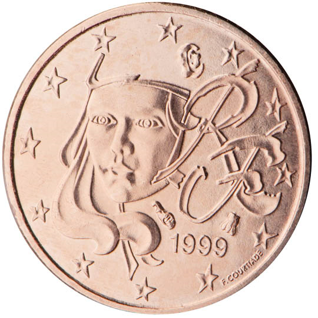

# France € 0.01

## Images

## Metadata

**Country:** [France](../index.md)\
**Serie:** [France 1999 - 2022](index.md)\
**Monetary value:** € 0.01\
**Currency:** Euro

## Description

Marianne (Symbol of the French Republic since the Revolution)

## Mintages

| Year | Mintmark | Circulated | Brilliant Uncirculated | Proof |
| ---- | -------- | ---------- | ---------------------- | ----- |
| 1999 |          | 794000000  | 35000                  | 15000 |
| 2000 |          | 605200000  | 35000                  | 15000 |
| 2001 |          | 300600000  | 35000                  | 15000 |
| 2002 |          | 110000     | 164000                 | 21000 |
| 2003 |          | 160000000  | 197000                 | 15000 |
| 2004 |          | 400000000  | 129100                 | 11000 |
| 2005 |          | 240200000  | 75100                  | 8000  |
| 2006 |          | 343000000  | 60080                  | 9800  |
| 2007 |          | 320100000  | 59000                  | 7500  |
| 2008 |          | 462600100  | 62000                  | 7500  |
| 2009 |          | 436300000  | 49000                  | 7500  |
| 2010 |          | 335500000  | 49500                  | 8000  |
| 2011 |          | 320100000  | 37500                  | 9000  |
| 2012 |          | 358500000  | 30740                  | 7800  |
| 2013 |          | 282900000  | 28500                  | 8500  |
| 2014 |          | 365000000  | 28500                  | 7500  |
| 2015 |          | 287200000  | 27500                  | 7500  |
| 2016 |          | 293800000  | 28500                  | 7500  |
| 2017 |          | 270000000  | 28500                  | 7500  |
| 2018 |          | 207000000  | 29000                  | 7500  |
| 2019 |          | 176700000  | 17500                  | 7500  |
| 2020 |          | 0          | 19500                  | 7500  |
| 2021 |          | 0          | 2000                   | 7500  |
| 2022 |          | 0          | 29500                  | 9522  |
| 2023 |          | 0          | 26500                  | 9522  |
