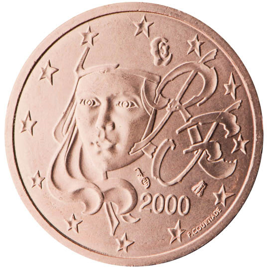

# France € 0.02

## Images

## Metadata

**Country:** [France](../index.md)\
**Serie:** [France 1999 - 2002](index.md)\
**Monetary value:** € 0.02\
**Currency:** Euro

## Description

## Mintages

| Year | Mintmark | Circulated | Brilliant Uncirculated | Proof |
| ---- | -------- | ---------- | ---------------------- | ----- |
| 1999 |          | 755104000  | 35000                  | 15000 |
| 2000 |          | 510155000  | 35000                  | 15000 |
| 2001 |          | 249110580  | 35000                  | 15000 |
| 2002 |          | 177928     | 165290                 | 21453 |
| 2003 |          | 160248490  | 132139                 | 15200 |
| 2004 |          | 300153103  | 129103                 | 11033 |
| 2005 |          | 260262151  | 75151                  | 8519  |
| 2006 |          | 283227770  | 50270                  | 9811  |
| 2007 |          | 220399976  | 49976                  | 7500  |
| 2008 |          | 386582000  | 50000                  | 7500  |
| 2009 |          | 343167323  | 47323                  | 7500  |
| 2010 |          | 277085814  | 44814                  | 8992  |
| 2011 |          | 250163657  | 35657                  | 9000  |
| 2012 |          | 277696465  | 28465                  | 7804  |
| 2013 |          | 220669000  | 25000                  | 6976  |
| 2014 |          | 209977000  | 25000                  | 7500  |
| 2015 |          | 199285000  | 25000                  | 7500  |
| 2016 |          | 192525000  | 25000                  | 7500  |
| 2017 |          | 200025000  | 25000                  | 7500  |
| 2018 |          | 142625000  | 25000                  | 7500  |
| 2019 |          | 161295000  | 15000                  | 7500  |
| 2020 |          | 15000      | 15000                  | 750   |
| 2021 |          | 0          | 0                      | 0     |
