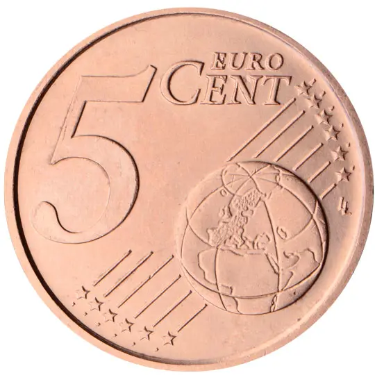

# France € 0.05

## Images

## Metadata

**Country:** [France](../index.md)\
**Serie:** [France 1999 - 2022](index.md)\
**Monetary value:** € 0.05\
**Currency:** Euro

## Description

Marianne (Symbol of the French Republic since the Revolution)

## Mintages

| Year | Mintmark | Circulated | Brilliant Uncirculated | Proof |
| ---- | -------- | ---------- | ---------------------- | ----- |
| 1999 |          | 616192000  | 35000                  | 15000 |
| 2000 |          | 280064000  | 35000                  | 15000 |
| 2001 |          | 217289000  | 35000                  | 15000 |
| 2002 |          | 186283000  | 164000                 | 21000 |
| 2003 |          | 100977000  | 197000                 | 15000 |
| 2004 |          | 60162000   | 129100                 | 11000 |
| 2005 |          | 20174000   | 75100                  | 8000  |
| 2006 |          | 132049000  | 60080                  | 9800  |
| 2007 |          | 130062000  | 59000                  | 7500  |
| 2008 |          | 218232000  | 62000                  | 7500  |
| 2009 |          | 184710000  | 49000                  | 7500  |
| 2010 |          | 184232000  | 49500                  | 8000  |
| 2011 |          | 144900000  | 37500                  | 9000  |
| 2012 |          | 139104000  | 30740                  | 7800  |
| 2013 |          | 147168000  | 28500                  | 8500  |
| 2014 |          | 130032000  | 28500                  | 7500  |
| 2015 |          | 97020000   | 27500                  | 7500  |
| 2016 |          | 142000000  | 28500                  | 7500  |
| 2017 |          | 130000000  | 28500                  | 7500  |
| 2018 |          | 75600000   | 29000                  | 7500  |
| 2019 |          | 105930000  | 17500                  | 7500  |
| 2020 |          | 15000      | 19500                  | 7500  |
| 2021 |          | 0          | 2000                   | 7500  |
| 2022 |          | 0          | 29500                  | 9522  |
| 2023 |          | 0          | 26500                  | 9522  |
