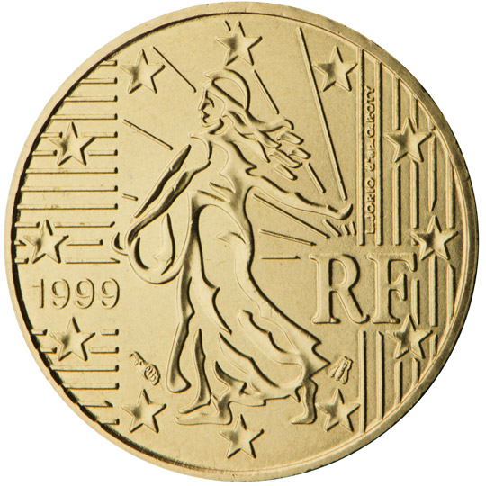

# France € 0.10

## Images

## Metadata

**Country:** [France](../index.md)\
**Serie:** [France 1999 - 2002](index.md)\
**Monetary value:** € 0.10\
**Currency:** Euro

## Description

Sower (Motif of the former Franc)

## Mintages

| Year | Mintmark | Circulated | Brilliant Uncirculated | Proof |
| ---- | -------- | ---------- | ---------------------- | ----- |
| 1999 |          | 447249000 | 35000                  | 15000 |
| 2000 |          | 297432000 | 35000                  | 15000 |
| 2001 |          | 144478000 | 35000                  | 15000 |
| 2002 |          | 206646000 | 164000                 | 21000 |
| 2003 |          | 180717000 | 197000                 | 15000 |
| 2004 |          | 1468000   | 129100                 | 11000 |
| 2005 |          | 43576000  | 75100                  | 8000  |
| 2006 |          | 60223000  | 60080                  | 9800  |
| 2007 |          | 90950000  | 59000                  | 7500  |
| 2008 |          | 178706000 | 62000                  | 7500  |
| 2009 |          | 142710000 | 49000                  | 7500  |
| 2010 |          | 76153000  | 49500                  | 8000  |
| 2011 |          | 99878000  | 37500                  | 9000  |
| 2012 |          | 77357000  | 30740                  | 7800  |
| 2013 |          | 139780000 | 28500                  | 8500  |
| 2014 |          | 35006000  | 28500                  | 7500  |
| 2015 |          | 70990000  | 27500                  | 7500  |
| 2016 |          | 115900000 | 28500                  | 7500  |
| 2017 |          | 90000000  | 28500                  | 7500  |
| 2018 |          | 99300000  | 29000                  | 7500  |
| 2019 |          | 77000000  | 17500                  | 7500  |
| 2020 |          |  | 19500                  | 7500  |
| 2021 |          | 0          | 2000                   | 7500  |
