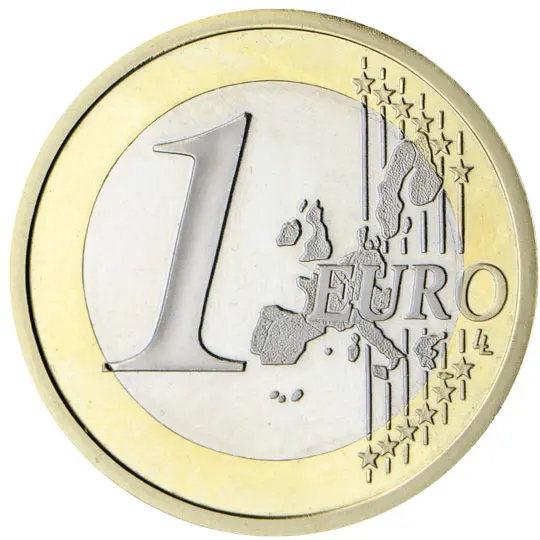

# France € 1.00

## Images

## Metadata

**Country:** [France](../index.md)\
**Serie:** [France 1999 - 2002](index.md)\
**Monetary value:** € 1.00\
**Currency:** Euro

## Description

## Mintages

| Year | Mintmark | Circulated | Brilliant Uncirculated | Proof |
| ---- | -------- | ---------- | ---------------------- | ----- |
| 1999 |          | 354085000  | 35000                  | 15000 |
| 2000 |          | 297305000  | 35000                  | 15000 |
| 2001 |          | 150251624  | 35000                  | 15000 |
| 2002 |          | 129501928  | 165290                 | 21453 |
| 2003 |          | 119501     | 132139                 | 15200 |
| 2004 |          | 129103     | 129103                 | 11033 |
| 2005 |          | 75151      | 75151                  | 8519  |
| 2006 |          | 50270      | 50270                  | 9811  |
| 2007 |          | 49976      | 49976                  | 7500  |
| 2008 |          | 50000      | 50000                  | 7500  |
| 2009 |          | 47323      | 47323                  | 7500  |
| 2010 |          | 44814      | 44814                  | 8992  |
| 2011 |          | 35657      | 35657                  | 9000  |
| 2012 |          | 28465      | 28465                  | 7804  |
| 2013 |          | 25000      | 25000                  | 6976  |
| 2014 |          | 25000      | 25000                  | 7500  |
| 2015 |          | 25000      | 25000                  | 7500  |
| 2016 |          | 25000      | 25000                  | 7500  |
| 2017 |          | 25000      | 25000                  | 7500  |
| 2018 |          | 25000      | 25000                  | 7500  |
| 2019 |          | 15000      | 15000                  | 7500  |
| 2020 |          | 15000      | 15000                  | 750   |
| 2021 |          | 0          | 0                      | 0     |
