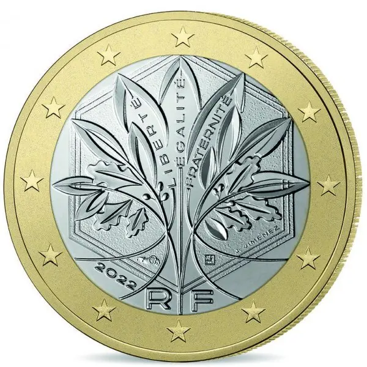

# France € 1.00

## Images

## Metadata

**Country:** [France](../index.md)\
**Serie:** [France ~2022 - ...](index.md)\
**Monetary value:** € 1.00\
**Currency:** Euro

## Description

Oak and olive branches that form the tree of life and symbolise strength, solidity and peace. The tree and the motto stand within a hexagon.

## Mintages

| Year | Mintmark | Circulated | Brilliant Uncirculated | Proof |
| ---- | -------- | ---------- | ---------------------- | ----- |
| 2022 |          | 30000000   | 39500                  | 11544 |
| 2023 |          | 0          | 26500                  | 9522  |
| 2024 |          | 0          | 29000                  | 5000  |
| 2025 |          | 0          | 0                      | 0     |
| 2026 |          | 0          | 0                      | 0     |
