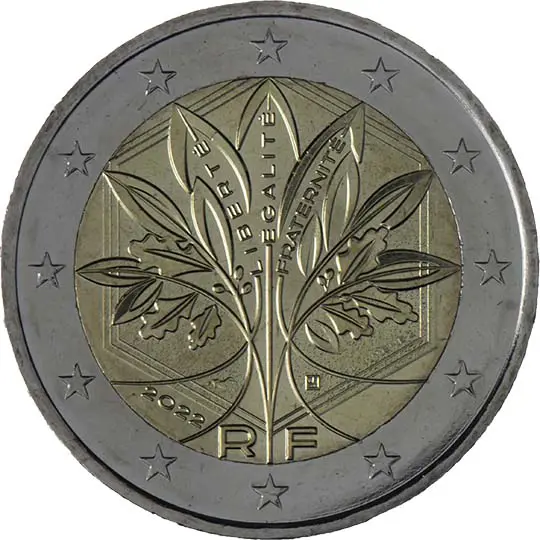

# France € 2.00

## Images

## Metadata

**Country:** [France](../index.md)\
**Serie:** [France 2022 - 2024](index.md)\
**Monetary value:** € 2.00\
**Currency:** Euro

## Description

## Mintages

| Year | Mintmark | Circulated | Brilliant Uncirculated | Proof |
| ---- | -------- | ---------- | ---------------------- | ----- |
| 2022 |          | 30000000   | 39500                  | 11544 |
| 2023 |          | 0          | 26500                  | 9522  |
