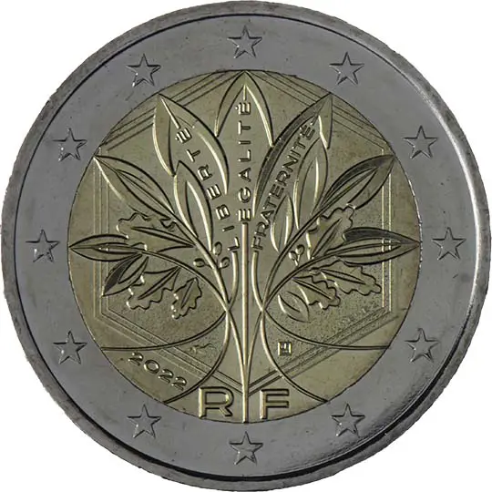

# France € 2.00

## Images

## Metadata

**Country:** [France](../index.md)\
**Serie:** [France 2024 - ...](index.md)\
**Monetary value:** € 2.00\
**Currency:** Euro

## Description

## Mintages

| Year | Mintmark | Circulated | Brilliant Uncirculated | Proof |
| ---- | -------- | ---------- | ---------------------- | ----- |
| 2024 |  | 0 | 0 | 0 |
