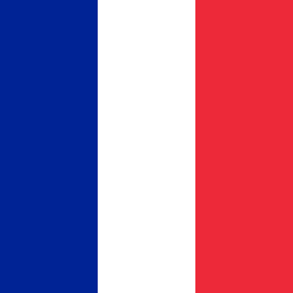

# France

## Metadata

**Isocode:** FR

## Description

France is a republic in western Europe. The country is located on the North Sea. France has been paying with the euro since 2002.

## Images

