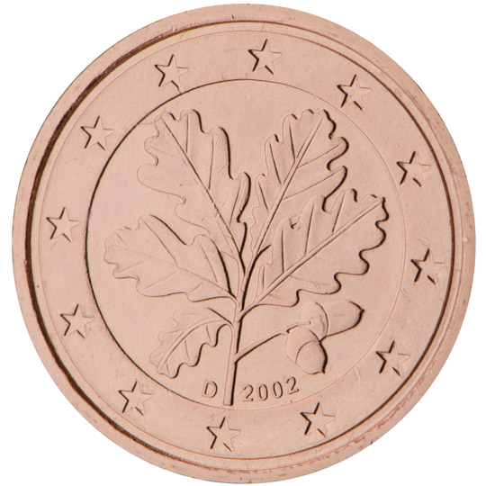

# Germany € 0.01

## Images

## Metadata

**Country:** [Germany](../index.md)\
**Serie:** [Germany 2002 - ...](index.md)\
**Monetary value:** € 0.01\
**Currency:** Euro

## Description

## Mintages

| Year | Mintmark | Circulated | Brilliant Uncirculated | Proof  |
| ---- | -------- | ---------- | ---------------------- | ------ |
| 2002 | A        | 800000000  | 135000                 | 100000 |
| 2002 | D        | 840000000  | 135000                 | 100000 |
| 2002 | F        | 960000000  | 135000                 | 100000 |
| 2002 | G        | 560000000  | 135000                 | 100000 |
| 2002 | J        | 940000000  | 135000                 | 100000 |
| 2003 | A        | 0          | 180000                 | 120000 |
| 2003 | D        | 0          | 180000                 | 120000 |
| 2003 | F        | 0          | 180000                 | 120000 |
| 2003 | G        | 0          | 180000                 | 120000 |
| 2003 | J        | 0          | 180000                 | 120000 |
| 2004 | A        | 280000000  | 106000                 | 106000 |
| 2004 | D        | 294000000  | 106000                 | 106000 |
| 2004 | F        | 336000000  | 106000                 | 106000 |
| 2004 | G        | 196000000  | 106000                 | 106000 |
| 2004 | J        | 294000000  | 106000                 | 106000 |
| 2005 | A        | 120000000  | 85000                  | 85000  |
| 2005 | D        | 126000000  | 85000                  | 85000  |
| 2005 | F        | 144000000  | 85000                  | 85000  |
| 2005 | G        | 84000000   | 85000                  | 85000  |
| 2005 | J        | 126000000  | 85000                  | 85000  |
| 2006 | A        | 0          | 75000                  | 75000  |
| 2006 | D        | 0          | 75000                  | 75000  |
| 2006 | F        | 0          | 75000                  | 75000  |
| 2006 | G        | 0          | 75000                  | 75000  |
| 2006 | J        | 0          | 75000                  | 75000  |
| 2007 | A        | 119400000  | 70000                  | 75000  |
| 2007 | D        | 125370000  | 70000                  | 75000  |
| 2007 | F        | 143280000  | 70000                  | 75000  |
| 2007 | G        | 83580000   | 70000                  | 75000  |
| 2007 | J        | 125370000  | 70000                  | 75000  |
| 2008 | A        | 101200000  | 55600                  | 55000  |
| 2008 | D        | 106260000  | 55600                  | 55000  |
| 2008 | F        | 121440000  | 55600                  | 55000  |
| 2008 | G        | 70840000   | 55600                  | 55000  |
| 2008 | J        | 106260000  | 55600                  | 55000  |
| 2009 | A        | 100000000  | 60000                  | 50000  |
| 2009 | D        | 105000000  | 60000                  | 50000  |
| 2009 | F        | 120000000  | 60000                  | 50000  |
| 2009 | G        | 70000000   | 60000                  | 50000  |
| 2009 | J        | 105000000  | 60000                  | 50000  |
| 2010 | A        | 94400000   | 53800                  | 45150  |
| 2010 | D        | 99120000   | 46800                  | 40120  |
| 2010 | F        | 113280000  | 46800                  | 40120  |
| 2010 | G        | 66080000   | 46800                  | 40120  |
| 2010 | J        | 99120000   | 46800                  | 40120  |
| 2011 | A        | 118400000  | 48000                  | 43000  |
| 2011 | D        | 124320000  | 44000                  | 37000  |
| 2011 | F        | 142080000  | 44000                  | 37000  |
| 2011 | G        | 82880000   | 44000                  | 37000  |
| 2011 | J        | 124320000  | 44000                  | 37000  |
| 2012 | A        | 104200000  | 45000                  | 40000  |
| 2012 | D        | 109410000  | 40000                  | 32000  |
| 2012 | F        | 125040000  | 40000                  | 32000  |
| 2012 | G        | 72940000   | 40000                  | 32000  |
| 2012 | J        | 109410000  | 40000                  | 32000  |
| 2013 | A        | 60000000   | 37380                  | 31000  |
| 2013 | D        | 63000000   | 37380                  | 31000  |
| 2013 | F        | 72000000   | 37380                  | 31000  |
| 2013 | G        | 42000000   | 37380                  | 31000  |
| 2013 | J        | 63000000   | 37380                  | 31000  |
| 2014 | A        | 66000000   | 34000                  | 28400  |
| 2014 | D        | 69300000   | 34000                  | 28400  |
| 2014 | F        | 79200000   | 34000                  | 28400  |
| 2014 | G        | 46200000   | 34000                  | 28400  |
| 2014 | J        | 69300000   | 34000                  | 28400  |
| 2015 | A        | 86200000   | 39800                  | 34000  |
| 2015 | D        | 90510000   | 33825                  | 27000  |
| 2015 | F        | 103440000  | 33825                  | 27000  |
| 2015 | G        | 60340000   | 33825                  | 27000  |
| 2015 | J        | 90510000   | 33825                  | 27000  |
| 2016 | A        | 116600000  | 34800                  | 30000  |
| 2016 | D        | 122430000  | 30825                  | 24000  |
| 2016 | F        | 139920000  | 30825                  | 24000  |
| 2016 | G        | 81620000   | 30825                  | 24000  |
| 2016 | J        | 122430000  | 30825                  | 24000  |
| 2017 | A        | 81600000   | 31000                  | 27000  |
| 2017 | D        | 85680000   | 25000                  | 20000  |
| 2017 | F        | 97920000   | 25000                  | 20000  |
| 2017 | G        | 57120000   | 25000                  | 20000  |
| 2017 | J        | 85680000   | 25000                  | 20000  |
| 2018 | A        | 90600000   | 27400                  | 24000  |
| 2018 | D        | 95130000   | 22625                  | 20000  |
| 2018 | F        | 108720000  | 22625                  | 20000  |
| 2018 | G        | 63420000   | 22625                  | 20000  |
| 2018 | J        | 95130000   | 22625                  | 20000  |
| 2019 | A        | 71100000   | 23900                  | 21000  |
| 2019 | D        | 76170000   | 78400                  | 66000  |
| 2019 | F        | 85380000   | 78400                  | 66000  |
| 2019 | G        | 49680000   | 78400                  | 66000  |
| 2019 | J        | 74670000   | 78400                  | 66000  |
| 2020 | A        | 49000000   | 22500                  | 21000  |
| 2020 | D        | 51450000   | 22500                  | 21000  |
| 2020 | F        | 58800000   | 22500                  | 21000  |
| 2020 | G        | 34300000   | 22500                  | 21000  |
| 2020 | J        | 51450000   | 22500                  | 21000  |
| 2021 | A        | 51040000   | 22000                  | 22000  |
| 2021 | D        | 53970000   | 22000                  | 22000  |
| 2021 | F        | 61680000   | 22000                  | 22000  |
| 2021 | G        | 35980000   | 22000                  | 22000  |
| 2021 | J        | 53970000   | 22000                  | 22000  |
| 2022 | A        | 0          | 18200                  | 16900  |
| 2022 | D        | 0          | 16100                  | 13300  |
| 2022 | F        | 0          | 15500                  | 12800  |
| 2022 | G        | 0          | 15700                  | 13000  |
| 2022 | J        | 0          | 15600                  | 12800  |
| 2023 | A        | 28800000   | 0                      | 0      |
| 2023 | D        | 30240000   | 0                      | 0      |
| 2023 | F        | 34560000   | 0                      | 0      |
| 2023 | G        | 20160000   | 0                      | 0      |
| 2023 | J        | 30240000   | 0                      | 0      |
| 2024 | A        | 0          | 0                      | 0      |
| 2024 | D        | 0          | 0                      | 0      |
| 2024 | F        | 0          | 0                      | 0      |
| 2024 | G        | 0          | 0                      | 0      |
| 2024 | J        | 0          | 0                      | 0      |
