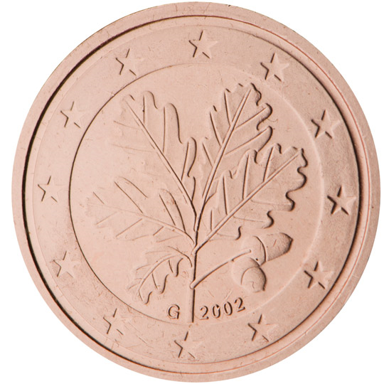

# Germany € 0.02

## Images

## Metadata

**Country:** [Germany](../index.md)\
**Serie:** [Germany 2002 - ...](index.md)\
**Monetary value:** € 0.02\
**Currency:** Euro\
**Designer:** Rolf Lederbogen

## Description

Oak branch

## Mintages

| Year | Mintmark | Circulated | Brilliant Uncirculated | Proof  |
| ---- | -------- | ---------- | ---------------------- | ------ |
| 2002 | A        | 360000000  | 135000                 | 100000 |
| 2002 | D        | 483000000  | 135000                 | 100000 |
| 2002 | F        | 507800000  | 135000                 | 100000 |
| 2002 | G        | 311800000  | 135000                 | 100000 |
| 2002 | J        | 419400000  | 135000                 | 100000 |
| 2003 | A        | 200000000  | 180000                 | 120000 |
| 2003 | D        | 105000000  | 180000                 | 120000 |
| 2003 | F        | 164200000  | 180000                 | 120000 |
| 2003 | G        | 80200000   | 180000                 | 120000 |
| 2003 | J        | 168600000  | 180000                 | 120000 |
| 2004 | A        | 127000000  | 106000                 | 106000 |
| 2004 | D        | 133350000  | 106000                 | 106000 |
| 2004 | F        | 152400000  | 106000                 | 106000 |
| 2004 | G        | 88900000   | 106000                 | 106000 |
| 2004 | J        | 133350000  | 106000                 | 106000 |
| 2005 | A        | 73000000   | 85000                  | 85000  |
| 2005 | D        | 76650000   | 85000                  | 85000  |
| 2005 | F        | 87600000   | 85000                  | 85000  |
| 2005 | G        | 51100000   | 85000                  | 85000  |
| 2005 | J        | 76650000   | 85000                  | 85000  |
| 2006 | A        | 108000000  | 75000                  | 75000  |
| 2006 | D        | 113400000  | 75000                  | 75000  |
| 2006 | F        | 129600000  | 75000                  | 75000  |
| 2006 | G        | 75600000   | 75000                  | 75000  |
| 2006 | J        | 148400000  | 75000                  | 75000  |
| 2007 | A        | 100000000  | 70000                  | 75000  |
| 2007 | D        | 105000000  | 70000                  | 75000  |
| 2007 | F        | 120000000  | 70000                  | 75000  |
| 2007 | G        | 70000000   | 70000                  | 75000  |
| 2007 | J        | 105000000  | 70000                  | 75000  |
| 2008 | A        | 80000000   | 55600                  | 55000  |
| 2008 | D        | 84000000   | 55600                  | 55000  |
| 2008 | F        | 96000000   | 55600                  | 55000  |
| 2008 | G        | 56000000   | 55600                  | 55000  |
| 2008 | J        | 84000000   | 55600                  | 55000  |
| 2009 | A        | 59000000   | 60000                  | 50000  |
| 2009 | D        | 61950000   | 60000                  | 50000  |
| 2009 | F        | 70800000   | 60000                  | 50000  |
| 2009 | G        | 41300000   | 60000                  | 50000  |
| 2009 | J        | 61950000   | 60000                  | 50000  |
| 2010 | A        | 72800000   | 53800                  | 45150  |
| 2010 | D        | 76440000   | 46800                  | 40120  |
| 2010 | F        | 87360000   | 46800                  | 40120  |
| 2010 | G        | 50960000   | 46800                  | 40120  |
| 2010 | J        | 76440000   | 46800                  | 40120  |
| 2011 | A        | 100400000  | 48000                  | 43000  |
| 2011 | D        | 105420000  | 44000                  | 37000  |
| 2011 | F        | 120480000  | 44000                  | 37000  |
| 2011 | G        | 70280000   | 44000                  | 37000  |
| 2011 | J        | 105420000  | 44000                  | 37000  |
| 2012 | A        | 77400000   | 45000                  | 40000  |
| 2012 | D        | 81270000   | 40000                  | 32000  |
| 2012 | F        | 92880000   | 40000                  | 32000  |
| 2012 | G        | 54180000   | 40000                  | 32000  |
| 2012 | J        | 81270000   | 40000                  | 32000  |
| 2013 | A        | 60000000   | 37380                  | 31000  |
| 2013 | D        | 63000000   | 37380                  | 31000  |
| 2013 | F        | 72000000   | 37380                  | 31000  |
| 2013 | G        | 42000000   | 37380                  | 31000  |
| 2013 | J        | 63000000   | 37380                  | 31000  |
| 2014 | A        | 61800000   | 34000                  | 28400  |
| 2014 | D        | 64890000   | 34000                  | 28400  |
| 2014 | F        | 74160000   | 34000                  | 28400  |
| 2014 | G        | 43260000   | 34000                  | 28400  |
| 2014 | J        | 64890000   | 34000                  | 28400  |
| 2015 | A        | 76000000   | 39800                  | 34000  |
| 2015 | D        | 79800000   | 33825                  | 27000  |
| 2015 | F        | 91200000   | 33825                  | 27000  |
| 2015 | G        | 53200000   | 33825                  | 27000  |
| 2015 | J        | 79800000   | 33825                  | 27000  |
| 2016 | A        | 101400000  | 34800                  | 30000  |
| 2016 | D        | 106470000  | 30825                  | 24000  |
| 2016 | F        | 121680000  | 30825                  | 24000  |
| 2016 | G        | 70980000   | 30825                  | 24000  |
| 2016 | J        | 106470000  | 30825                  | 24000  |
| 2017 | A        | 72200000   | 31000                  | 27000  |
| 2017 | D        | 75810000   | 25000                  | 20000  |
| 2017 | F        | 86640000   | 25000                  | 20000  |
| 2017 | G        | 50540000   | 25000                  | 20000  |
| 2017 | J        | 75810000   | 25000                  | 20000  |
| 2018 | A        | 95800000   | 27400                  | 24000  |
| 2018 | D        | 100590000  | 22625                  | 20000  |
| 2018 | F        | 114960000  | 22625                  | 20000  |
| 2018 | G        | 67060000   | 22625                  | 20000  |
| 2018 | J        | 100590000  | 22625                  | 20000  |
| 2019 | A        | 83700000   | 23900                  | 21000  |
| 2019 | D        | 89400000   | 78400                  | 66000  |
| 2019 | F        | 100500000  | 78400                  | 66000  |
| 2019 | G        | 58500000   | 78400                  | 66000  |
| 2019 | J        | 87900000   | 78400                  | 66000  |
| 2020 | A        | 65800000   | 22500                  | 21000  |
| 2020 | D        | 69090000   | 22500                  | 21000  |
| 2020 | F        | 78960000   | 22500                  | 21000  |
| 2020 | G        | 46060000   | 22500                  | 21000  |
| 2020 | J        | 69090000   | 22500                  | 21000  |
| 2021 | A        | 97600000   | 22000                  | 22000  |
| 2021 | D        | 102480000  | 22000                  | 22000  |
| 2021 | F        | 117120000  | 22000                  | 22000  |
| 2021 | G        | 68320000   | 22000                  | 22000  |
| 2021 | J        | 102480000  | 22000                  | 22000  |
| 2022 | A        | 42200000   | 18200                  | 16900  |
| 2022 | D        | 44310000   | 16100                  | 13300  |
| 2022 | F        | 50640000   | 15500                  | 12800  |
| 2022 | G        | 29540000   | 15700                  | 13000  |
| 2022 | J        | 44310000   | 15600                  | 12800  |
| 2023 | A        | 18000000   | 0                      | 0      |
| 2023 | D        | 9450000    | 0                      | 0      |
| 2023 | F        | 21600000   | 0                      | 0      |
| 2023 | G        | 12600000   | 0                      | 0      |
| 2023 | J        | 18900000   | 0                      | 0      |
| 2024 | A        | 0          | 0                      | 0      |
| 2024 | D        | 0          | 0                      | 0      |
| 2024 | F        | 0          | 0                      | 0      |
| 2024 | G        | 0          | 0                      | 0      |
| 2024 | J        | 0          | 0                      | 0      |
| 2025 | A        | 0          | 0                      | 0      |
| 2025 | D        | 0          | 0                      | 0      |
| 2025 | F        | 0          | 0                      | 0      |
| 2025 | G        | 0          | 0                      | 0      |
| 2025 | J        | 0          | 0                      | 0      |
| 2026 | A        | 0          | 0                      | 0      |
| 2026 | D        | 0          | 0                      | 0      |
| 2026 | F        | 0          | 0                      | 0      |
| 2026 | G        | 0          | 0                      | 0      |
| 2026 | J        | 0          | 0                      | 0      |
