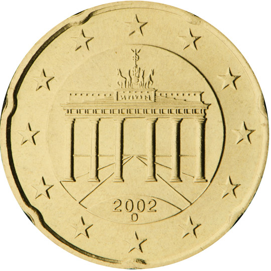

# Germany € 0.20

## Images

## Metadata

**Country:** [Germany](../index.md)\
**Serie:** [Germany 2002 - ...](index.md)\
**Monetary value:** € 0.20\
**Currency:** Euro

## Description

Brandenburg Gate

## Mintages

| Year | Mintmark | Circulated | Brilliant Uncirculated | Proof  |
| ---- | -------- | ---------- | ---------------------- | ------ |
| 2002 | A        | 378150000  | 135000                 | 100000 |
| 2002 | D        | 367000000  | 135000                 | 100000 |
| 2002 | F        | 421600000  | 135000                 | 100000 |
| 2002 | G        | 251900000  | 135000                 | 100000 |
| 2002 | J        | 441000000  | 135000                 | 100000 |
| 2003 | A        | 41860000   | 180000                 | 120000 |
| 2003 | D        | 24100000   | 180000                 | 120000 |
| 2003 | F        | 82400000   | 180000                 | 120000 |
| 2003 | G        | 42100000   | 180000                 | 120000 |
| 2003 | J        | 0          | 180000                 | 120000 |
| 2004 | A        | 0          | 106000                 | 106000 |
| 2004 | D        | 49760000   | 106000                 | 106000 |
| 2004 | F        | 0          | 106000                 | 106000 |
| 2004 | G        | 0          | 106000                 | 106000 |
| 2004 | J        | 0          | 106000                 | 106000 |
| 2005 | A        | 8000000    | 85000                  | 85000  |
| 2005 | D        | 8400000    | 85000                  | 85000  |
| 2005 | F        | 9600000    | 85000                  | 85000  |
| 2005 | G        | 5600000    | 85000                  | 85000  |
| 2005 | J        | 8400000    | 85000                  | 85000  |
| 2006 | A        | 39000000   | 75000                  | 75000  |
| 2006 | D        | 40950000   | 75000                  | 75000  |
| 2006 | F        | 46800000   | 75000                  | 75000  |
| 2006 | G        | 27300000   | 75000                  | 75000  |
| 2006 | J        | 40950000   | 75000                  | 75000  |
| 2007 | A        | 21600000   | 70000                  | 75000  |
| 2007 | D        | 22680000   | 70000                  | 75000  |
| 2007 | F        | 25920000   | 70000                  | 75000  |
| 2007 | G        | 15120000   | 70000                  | 75000  |
| 2007 | J        | 22930000   | 70000                  | 75000  |
| 2008 | A        | 15800000   | 55600                  | 55000  |
| 2008 | D        | 16590000   | 55600                  | 55000  |
| 2008 | F        | 18960000   | 55600                  | 55000  |
| 2008 | G        | 11060000   | 55600                  | 55000  |
| 2008 | J        | 16340000   | 55600                  | 55000  |
| 2009 | A        | 21600000   | 60000                  | 50000  |
| 2009 | D        | 22680000   | 60000                  | 50000  |
| 2009 | F        | 25920000   | 60000                  | 50000  |
| 2009 | G        | 15120000   | 60000                  | 50000  |
| 2009 | J        | 22680000   | 60000                  | 50000  |
| 2010 | A        | 24400000   | 53800                  | 45150  |
| 2010 | D        | 25620000   | 46800                  | 40120  |
| 2010 | F        | 29280000   | 46800                  | 40120  |
| 2010 | G        | 17080000   | 46800                  | 40120  |
| 2010 | J        | 25620000   | 46800                  | 40120  |
| 2011 | A        | 33000000   | 48000                  | 43000  |
| 2011 | D        | 34650000   | 44000                  | 37000  |
| 2011 | F        | 39600000   | 44000                  | 37000  |
| 2011 | G        | 23100000   | 44000                  | 37000  |
| 2011 | J        | 34650000   | 44000                  | 37000  |
| 2012 | A        | 21200000   | 45000                  | 40000  |
| 2012 | D        | 22260000   | 40000                  | 32000  |
| 2012 | F        | 25440000   | 40000                  | 32000  |
| 2012 | G        | 14840000   | 40000                  | 32000  |
| 2012 | J        | 22260000   | 40000                  | 32000  |
| 2013 | A        | 16000000   | 37380                  | 31000  |
| 2013 | D        | 16800000   | 37380                  | 31000  |
| 2013 | F        | 19200000   | 37380                  | 31000  |
| 2013 | G        | 11200000   | 37380                  | 31000  |
| 2013 | J        | 16800000   | 37380                  | 31000  |
| 2014 | A        | 19200000   | 34000                  | 28400  |
| 2014 | D        | 20160000   | 34000                  | 28400  |
| 2014 | F        | 23040000   | 34000                  | 28400  |
| 2014 | G        | 13440000   | 34000                  | 28400  |
| 2014 | J        | 20160000   | 34000                  | 28400  |
| 2015 | A        | 22800000   | 39800                  | 34000  |
| 2015 | D        | 23940000   | 33825                  | 27000  |
| 2015 | F        | 27360000   | 33825                  | 27000  |
| 2015 | G        | 15960000   | 33825                  | 27000  |
| 2015 | J        | 23940000   | 33825                  | 27000  |
| 2016 | A        | 38400000   | 34800                  | 30000  |
| 2016 | D        | 40320000   | 30825                  | 24000  |
| 2016 | F        | 46080000   | 30825                  | 24000  |
| 2016 | G        | 26880000   | 30825                  | 24000  |
| 2016 | J        | 40320000   | 30825                  | 24000  |
| 2017 | A        | 21600000   | 31000                  | 27000  |
| 2017 | D        | 22680000   | 25000                  | 20000  |
| 2017 | F        | 25920000   | 25000                  | 20000  |
| 2017 | G        | 15120000   | 25000                  | 20000  |
| 2017 | J        | 22680000   | 25000                  | 20000  |
| 2018 | A        | 28400000   | 27400                  | 24000  |
| 2018 | D        | 29820000   | 22625                  | 20000  |
| 2018 | F        | 34080000   | 22625                  | 20000  |
| 2018 | G        | 19880000   | 22625                  | 20000  |
| 2018 | J        | 29820000   | 22625                  | 20000  |
| 2019 | A        | 33800000   | 23900                  | 21000  |
| 2019 | D        | 37010000   | 78400                  | 66000  |
| 2019 | F        | 40620000   | 78400                  | 66000  |
| 2019 | G        | 23570000   | 78400                  | 66000  |
| 2019 | J        | 35510000   | 78400                  | 66000  |
| 2020 | A        | 23080000   | 22500                  | 21000  |
| 2020 | D        | 24990000   | 22500                  | 21000  |
| 2020 | F        | 28560000   | 22500                  | 21000  |
| 2020 | G        | 16600000   | 22500                  | 21000  |
| 2020 | J        | 24990000   | 22500                  | 21000  |
| 2021 | A        | 30000000   | 22000                  | 22000  |
| 2021 | D        | 31500000   | 22000                  | 22000  |
| 2021 | F        | 36000000   | 22000                  | 22000  |
| 2021 | G        | 21000000   | 22000                  | 22000  |
| 2021 | J        | 31500000   | 22000                  | 22000  |
| 2022 | A        | 26200000   | 18200                  | 16900  |
| 2022 | D        | 27510000   | 16100                  | 13300  |
| 2022 | F        | 31440000   | 15500                  | 12800  |
| 2022 | G        | 18340000   | 15700                  | 13000  |
| 2022 | J        | 27510000   | 15600                  | 12800  |
| 2023 | A        | 11000000   | 0                      | 0      |
| 2023 | D        | 11550000   | 0                      | 0      |
| 2023 | F        | 13200000   | 0                      | 0      |
| 2023 | G        | 7700000    | 0                      | 0      |
| 2023 | J        | 11550000   | 0                      | 0      |
| 2024 | A        | 0          | 0                      | 0      |
| 2024 | D        | 0          | 0                      | 0      |
| 2024 | F        | 0          | 0                      | 0      |
| 2024 | G        | 0          | 0                      | 0      |
| 2024 | J        | 0          | 0                      | 0      |
| 2025 | A        | 0          | 0                      | 0      |
| 2025 | D        | 0          | 0                      | 0      |
| 2025 | F        | 0          | 0                      | 0      |
| 2025 | G        | 0          | 0                      | 0      |
| 2025 | J        | 0          | 0                      | 0      |
