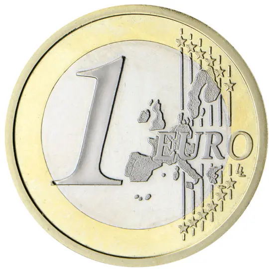
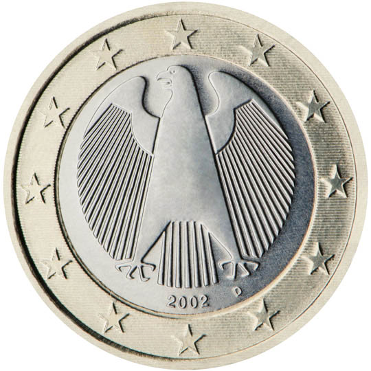

# Germany € 1.00

## Images

## Metadata

**Country:** [Germany](../index.md)\
**Serie:** [Germany 2002 - ...](index.md)\
**Monetary value:** € 1.00\
**Currency:** Euro

## Description

## Mintages

| Year | Mintmark | Circulated | Brilliant Uncirculated | Proof  |
| ---- | -------- | ---------- | ---------------------- | ------ |
| 2002 | A        | 367900000  | 135000                 | 100000 |
| 2002 | D        | 372600000  | 135000                 | 100000 |
| 2002 | F        | 439800000  | 135000                 | 100000 |
| 2002 | G        | 266350000  | 135000                 | 100000 |
| 2002 | J        | 372310000  | 135000                 | 100000 |
| 2003 | A        | 50250000   | 180000                 | 120000 |
| 2003 | D        | 0          | 180000                 | 120000 |
| 2003 | F        | 0          | 180000                 | 120000 |
| 2003 | G        | 0          | 180000                 | 120000 |
| 2003 | J        | 29850000   | 180000                 | 120000 |
| 2004 | A        | 21860000   | 106000                 | 106000 |
| 2004 | D        | 89260000   | 106000                 | 106000 |
| 2004 | F        | 88200000   | 106000                 | 106000 |
| 2004 | G        | 41650000   | 106000                 | 106000 |
| 2004 | J        | 0          | 106000                 | 106000 |
| 2005 | A        | 0          | 85000                  | 85000  |
| 2005 | D        | 0          | 85000                  | 85000  |
| 2005 | F        | 0          | 85000                  | 85000  |
| 2005 | G        | 0          | 85000                  | 85000  |
| 2005 | J        | 59840000   | 85000                  | 85000  |
| 2006 | A        | 0          | 75000                  | 75000  |
| 2006 | D        | 0          | 75000                  | 75000  |
| 2006 | F        | 0          | 75000                  | 75000  |
| 2006 | G        | 0          | 75000                  | 75000  |
| 2006 | J        | 0          | 75000                  | 75000  |
| 2007 | A        | 0          | 70000                  | 75000  |
| 2007 | D        | 0          | 70000                  | 75000  |
| 2007 | F        | 0          | 70000                  | 75000  |
| 2007 | G        | 0          | 70000                  | 75000  |
| 2007 | J        | 0          | 70000                  | 75000  |
| 2008 | A        | 0          | 55600                  | 55000  |
| 2008 | D        | 0          | 55600                  | 55000  |
| 2008 | F        | 0          | 55600                  | 55000  |
| 2008 | G        | 0          | 55600                  | 55000  |
| 2008 | J        | 0          | 55600                  | 55000  |
| 2009 | A        | 0          | 60000                  | 50000  |
| 2009 | D        | 0          | 60000                  | 50000  |
| 2009 | F        | 0          | 60000                  | 50000  |
| 2009 | G        | 0          | 60000                  | 50000  |
| 2009 | J        | 0          | 60000                  | 50000  |
| 2010 | A        | 0          | 53800                  | 45150  |
| 2010 | D        | 0          | 46800                  | 40120  |
| 2010 | F        | 0          | 46800                  | 40120  |
| 2010 | G        | 0          | 46800                  | 40120  |
| 2010 | J        | 0          | 46800                  | 40120  |
| 2011 | A        | 0          | 48000                  | 43000  |
| 2011 | D        | 0          | 44000                  | 37000  |
| 2011 | F        | 0          | 44000                  | 37000  |
| 2011 | G        | 0          | 44000                  | 37000  |
| 2011 | J        | 0          | 44000                  | 37000  |
| 2012 | A        | 0          | 45000                  | 40000  |
| 2012 | D        | 0          | 40000                  | 32000  |
| 2012 | F        | 0          | 40000                  | 32000  |
| 2012 | G        | 0          | 40000                  | 32000  |
| 2012 | J        | 0          | 40000                  | 32000  |
| 2013 | A        | 0          | 37380                  | 31000  |
| 2013 | D        | 0          | 37380                  | 31000  |
| 2013 | F        | 0          | 37380                  | 31000  |
| 2013 | G        | 0          | 37380                  | 31000  |
| 2013 | J        | 0          | 37380                  | 31000  |
| 2014 | A        | 0          | 34000                  | 28400  |
| 2014 | D        | 0          | 34000                  | 28400  |
| 2014 | F        | 0          | 34000                  | 28400  |
| 2014 | G        | 0          | 34000                  | 28400  |
| 2014 | J        | 0          | 34000                  | 28400  |
| 2015 | A        | 0          | 39800                  | 34000  |
| 2015 | D        | 0          | 33825                  | 27000  |
| 2015 | F        | 0          | 33825                  | 27000  |
| 2015 | G        | 0          | 33825                  | 27000  |
| 2015 | J        | 0          | 33825                  | 27000  |
| 2016 | A        | 0          | 34800                  | 30000  |
| 2016 | D        | 0          | 30825                  | 24000  |
| 2016 | F        | 0          | 30825                  | 24000  |
| 2016 | G        | 0          | 30825                  | 24000  |
| 2016 | J        | 0          | 30825                  | 24000  |
| 2017 | A        | 0          | 31000                  | 27000  |
| 2017 | D        | 0          | 25000                  | 20000  |
| 2017 | F        | 0          | 25000                  | 20000  |
| 2017 | G        | 0          | 25000                  | 20000  |
| 2017 | J        | 0          | 25000                  | 20000  |
| 2018 | A        | 0          | 27400                  | 24000  |
| 2018 | D        | 0          | 22625                  | 20000  |
| 2018 | F        | 0          | 22625                  | 20000  |
| 2018 | G        | 0          | 22625                  | 20000  |
| 2018 | J        | 0          | 22625                  | 20000  |
| 2019 | A        | 0          | 23900                  | 21000  |
| 2019 | D        | 0          | 78400                  | 66000  |
| 2019 | F        | 0          | 78400                  | 66000  |
| 2019 | G        | 0          | 78400                  | 66000  |
| 2019 | J        | 0          | 78400                  | 66000  |
| 2020 | A        | 0          | 22500                  | 21000  |
| 2020 | D        | 0          | 22500                  | 21000  |
| 2020 | F        | 0          | 22500                  | 21000  |
| 2020 | G        | 0          | 22500                  | 21000  |
| 2020 | J        | 0          | 22500                  | 21000  |
| 2021 | A        | 0          | 22000                  | 22000  |
| 2021 | D        | 0          | 22000                  | 22000  |
| 2021 | F        | 0          | 22000                  | 22000  |
| 2021 | G        | 0          | 22000                  | 22000  |
| 2021 | J        | 0          | 22000                  | 22000  |
| 2022 | A        | 0          | 18200                  | 16900  |
| 2022 | D        | 0          | 16100                  | 13300  |
| 2022 | F        | 0          | 15500                  | 12800  |
| 2022 | G        | 0          | 15700                  | 13000  |
| 2022 | J        | 0          | 15600                  | 12800  |
| 2023 | A        | 0          | 0                      | 0      |
| 2023 | D        | 0          | 0                      | 0      |
| 2023 | F        | 0          | 0                      | 0      |
| 2023 | G        | 0          | 0                      | 0      |
| 2023 | J        | 0          | 0                      | 0      |
| 2024 | A        | 0          | 0                      | 0      |
| 2024 | D        | 0          | 0                      | 0      |
| 2024 | F        | 0          | 0                      | 0      |
| 2024 | G        | 0          | 0                      | 0      |
| 2024 | J        | 0          | 0                      | 0      |
