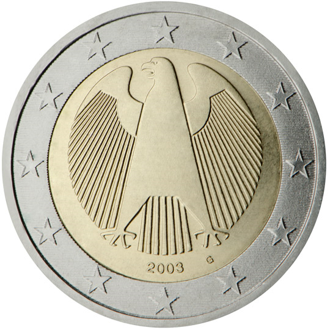

# Germany € 2.00

## Images

## Metadata

**Country:** [Germany](../index.md)\
**Serie:** [Germany 2002 - ...](index.md)\
**Monetary value:** € 2.00\
**Currency:** Euro

## Description

Federal Eagle

## Mintages

| Year | Mintmark | Circulated | Brilliant Uncirculated | Proof  |
| ---- | -------- | ---------- | ---------------------- | ------ |
| 2002 | A        | 238920000  | 135000                 | 100000 |
| 2002 | D        | 231300000  | 135000                 | 100000 |
| 2002 | F        | 281090000  | 135000                 | 100000 |
| 2002 | G        | 180950000  | 135000                 | 100000 |
| 2002 | J        | 257820000  | 135000                 | 100000 |
| 2003 | A        | 20470000   | 180000                 | 120000 |
| 2003 | D        | 22170000   | 180000                 | 120000 |
| 2003 | F        | 24460000   | 180000                 | 120000 |
| 2003 | G        | 29140000   | 180000                 | 120000 |
| 2003 | J        | 19500000   | 180000                 | 120000 |
| 2004 | A        | 31570000   | 106000                 | 106000 |
| 2004 | D        | 19840000   | 106000                 | 106000 |
| 2004 | F        | 0          | 106000                 | 106000 |
| 2004 | G        | 0          | 106000                 | 106000 |
| 2004 | J        | 22510000   | 106000                 | 106000 |
| 2005 | A        | 0          | 85000                  | 85000  |
| 2005 | D        | 0          | 85000                  | 85000  |
| 2005 | F        | 0          | 85000                  | 85000  |
| 2005 | G        | 0          | 85000                  | 85000  |
| 2005 | J        | 0          | 85000                  | 85000  |
| 2006 | A        | 0          | 75000                  | 75000  |
| 2006 | D        | 0          | 75000                  | 75000  |
| 2006 | F        | 0          | 75000                  | 75000  |
| 2006 | G        | 0          | 75000                  | 75000  |
| 2006 | J        | 0          | 75000                  | 75000  |
| 2008 | A        | 11400000   | 55600                  | 55000  |
| 2008 | D        | 11970000   | 55600                  | 55000  |
| 2008 | F        | 13680000   | 55600                  | 55000  |
| 2008 | G        | 7980000    | 55600                  | 55000  |
| 2008 | J        | 11970000   | 55600                  | 55000  |
| 2010 | A        | 19600000   | 53800                  | 45150  |
| 2010 | D        | 20580000   | 46800                  | 40120  |
| 2010 | F        | 23520000   | 46800                  | 40120  |
| 2010 | G        | 13720000   | 46800                  | 40120  |
| 2010 | J        | 20580000   | 46800                  | 40120  |
| 2011 | A        | 23800000   | 48000                  | 43000  |
| 2011 | D        | 24990000   | 44000                  | 37000  |
| 2011 | F        | 28560000   | 44000                  | 37000  |
| 2011 | G        | 16660000   | 44000                  | 37000  |
| 2011 | J        | 24990000   | 44000                  | 37000  |
| 2014 | A        | 5600000    | 34000                  | 28400  |
| 2014 | D        | 5880000    | 34000                  | 28400  |
| 2014 | F        | 6720000    | 34000                  | 28400  |
| 2014 | G        | 3920000    | 34000                  | 28400  |
| 2014 | J        | 5880000    | 34000                  | 28400  |
| 2016 | A        | 14200000   | 34800                  | 30000  |
| 2016 | D        | 14910000   | 30825                  | 24000  |
| 2016 | F        | 17040000   | 30825                  | 24000  |
| 2016 | G        | 9940000    | 30825                  | 24000  |
| 2016 | J        | 14910000   | 30825                  | 24000  |
| 2017 | A        | 18200000   | 31000                  | 27000  |
| 2017 | D        | 19110000   | 25000                  | 20000  |
| 2017 | F        | 21840000   | 25000                  | 20000  |
| 2017 | G        | 12740000   | 25000                  | 20000  |
| 2017 | J        | 19110000   | 25000                  | 20000  |
| 2019 | A        | 8020000    | 23900                  | 21000  |
| 2019 | D        | 12590000   | 78400                  | 66000  |
| 2019 | F        | 9680000    | 78400                  | 66000  |
| 2019 | G        | 5530000    | 78400                  | 66000  |
| 2019 | J        | 8430000    | 78400                  | 66000  |
| 2020 | A        | 16000000   | 22500                  | 21000  |
| 2020 | D        | 16800000   | 22500                  | 21000  |
| 2020 | F        | 19200000   | 22500                  | 21000  |
| 2020 | G        | 11200000   | 22500                  | 21000  |
| 2020 | J        | 16800000   | 22500                  | 21000  |
| 2021 | A        | 6000000    | 22000                  | 22000  |
| 2021 | D        | 6300000    | 22000                  | 22000  |
| 2021 | F        | 7200000    | 22000                  | 22000  |
| 2021 | G        | 4200000    | 22000                  | 22000  |
| 2021 | J        | 6300000    | 22000                  | 22000  |
| 2022 | A        | 0          | 18200                  | 16900  |
| 2022 | D        | 0          | 16100                  | 13300  |
| 2022 | F        | 0          | 15500                  | 12800  |
| 2022 | G        | 0          | 15700                  | 13000  |
| 2022 | J        | 0          | 15600                  | 12800  |
| 2023 | A        | 11000000   | 0                      | 0      |
| 2023 | D        | 11550000   | 0                      | 0      |
| 2023 | F        | 13200000   | 0                      | 0      |
| 2023 | G        | 7700000    | 0                      | 0      |
| 2023 | J        | 11550000   | 0                      | 0      |
| 2024 | A        | 7600000    | 0                      | 0      |
| 2024 | D        | 7980000    | 0                      | 0      |
| 2024 | F        | 9120000    | 0                      | 0      |
| 2024 | G        | 5320000    | 0                      | 0      |
| 2024 | J        | 7980000    | 0                      | 0      |
| 2025 | A        | 0          | 0                      | 0      |
| 2025 | D        | 0          | 0                      | 0      |
| 2025 | F        | 0          | 0                      | 0      |
| 2025 | G        | 0          | 0                      | 0      |
| 2025 | J        | 0          | 0                      | 0      |
