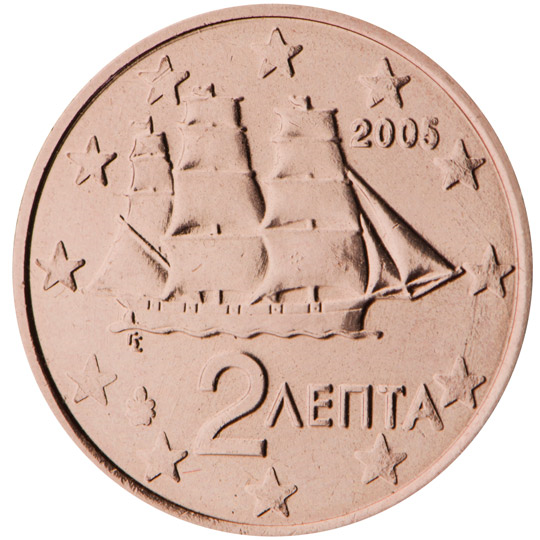

# Greece € 0.02

## Images

## Metadata

**Country:** [Greece](../index.md)\
**Serie:** [Greece 2002 - ...](index.md)\
**Monetary value:** € 0.02\
**Currency:** Euro

## Description

## Mintages

| Year | Mintmark | Circulated | Brilliant Uncirculated | Proof |
| ---- | -------- | ---------- | ---------------------- | ----- |
| 2002 | F | 0|  |  |
| 2002 |  | 0| 50000 |  |
| 2003 |  | 0| 50000 | 50000 |
| 2004 |  | 0| 30000 |  |
| 2005 |  | 0| 25000 | 25000 |
| 2006 |  | 0| 25000 | 25000 |
| 2007 |  | 0| 15000 | 10000 |
| 2008 |  | 0| 15000 | 10000 |
| 2009 |  | 0| 15000 | 10000 |
| 2010 |  | 0| 15000 | 10000 |
| 2011 |  | 0| 20000 | 17500 |
| 2012 |  | 0| 20000 | 12500 |
| 2013 |  | 0| 20000 | 4000 |
| 2014 |  | 0| 13000 | 2500 |
| 2015 |  | 0| 15000 | 2000 |
| 2016 |  | 0| 15000 | 2000 |
| 2017 |  | 0| 15000 | 1200 |
| 2018 |  | 0| 15000 | 2000 |
| 2019 |  | 0| 10000 | 1500 |
| 2020 |  | 0| 10000 |  |
