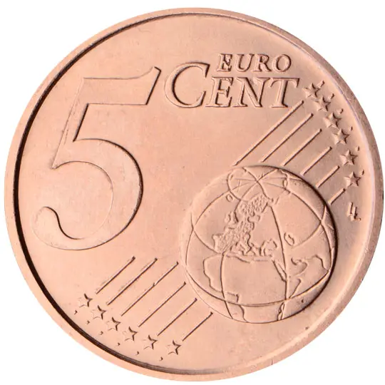
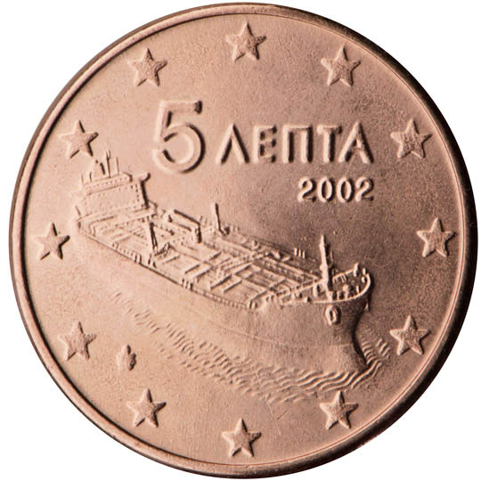

# Greece € 0.05

## Images

## Metadata

**Country:** [Greece](../index.md)\
**Serie:** [Greece 2002 - ...](index.md)\
**Monetary value:** € 0.05\
**Currency:** Euro\
**Designer:** Maria Andonatou, Georgios Stamatopoulos

## Description

Modern Ocean tanker

## Mintages

| Year | Mintmark | Circulated | Brilliant Uncirculated | Proof |
| ---- | -------- | ---------- | ---------------------- | ----- |
| 2002 | F        | 90000000   |                        | 0     |
| 2002 |          | 211000000  | 50000                  | 0     |
| 2003 |          | 750000     | 99000                  | 0     |
| 2004 |          | 250000     | 30000                  | 0     |
| 2005 |          | 1000000    | 50000                  | 0     |
| 2006 |          | 50000000   | 50000                  | 0     |
| 2007 |          | 55000000   | 25000                  | 0     |
| 2008 |          | 50000000   | 25000                  | 0     |
| 2009 |          | 38000000   | 20000                  | 0     |
| 2010 |          | 5000000    | 25000                  | 0     |
| 2011 |          | 34000000   | 35000                  | 2500  |
| 2012 |          | 5000000    | 30000                  | 2500  |
| 2013 |          | 0          | 20000                  | 4000  |
| 2014 |          | 18000000   | 13000                  | 2500  |
| 2015 |          | 10000000   | 15000                  | 2000  |
| 2016 |          | 27000000   | 15000                  | 2000  |
| 2017 |          | 8000000    | 15000                  | 1200  |
| 2018 |          | 15000000   | 15000                  | 2000  |
| 2019 |          | 36000000   | 10000                  | 1500  |
| 2020 |          | 13000000   | 10000                  | 0     |
| 2021 |          | 16000000   | 10000                  | 0     |
| 2022 |          | 24000000   | 7500                   | 0     |
| 2023 |          | 13000000   | 7500                   | 0     |
| 2024 |          | 7000000    | 5000                   | 0     |
| 2025 |          | 55000000   | 5000                   | 0     |
| 2026 |          | 0          | 0                      | 0     |

### Sources

#### 2020

- Mintages Circulated (https://www.euro-coins.info/images/files/Greece-Mintages-2020.pdf)
- Mintages BU (https://mint.bankofgreece.gr/media/no0l5kqb/numismatic_programme_2020_en.pdf)

#### 2021

- Mintages Circulated (https://www.euro-coins.info/images/files/Greece-Mintages-2021.pdf)
- Mintages BU (https://minfin.gov.gr/dimosionomiki-politiki/thisavrofylakio-kai-dimosionomikoi-kanones/nomismatiko-programma/nomismatiko-programma-2021/)

#### 2022

- Mintages Circulated (https://www.euro-coins.info/images/files/Greece-Mintages-2022.pdf)
- Mintages BU (https://mint.bankofgreece.gr/media/4ksg1rqh/nomismatiko-_pro-gramma_2022.pdf)
