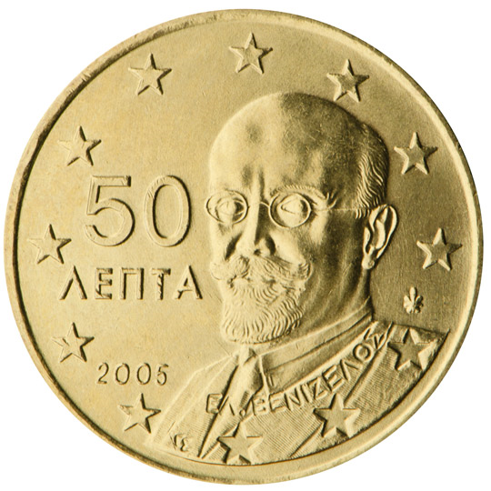

# Greece € 0.50

## Images

## Metadata

**Country:** [Greece](../index.md)\
**Serie:** [Greece 2002 - ...](index.md)\
**Monetary value:** € 0.50\
**Currency:** Euro

## Description

## Mintages

| Year | Mintmark | Circulated | Brilliant Uncirculated | Proof |
| ---- | -------- | ---------- | ---------------------- | ----- |
| 2002 | F        | 70000000   |                        |       |
| 2002 |          | 96050000   | 50000                  |       |
| 2003 |          | 800000     | 50000                  | 50000 |
| 2004 |          | 530000     | 30000                  |       |
| 2005 |          | 1050000    | 25000                  | 25000 |
| 2006 |          | 1050000    | 25000                  | 25000 |
| 2007 |          | 1025000    | 15000                  | 10000 |
| 2008 |          | 10025000   | 15000                  | 10000 |
| 2009 |          | 7025000    | 15000                  | 10000 |
| 2010 |          | 6025000    | 15000                  | 10000 |
| 2011 |          | 7035000    | 20000                  | 17500 |
| 2012 |          | 30000      | 20000                  | 12500 |
| 2013 |          | 20000      | 20000                  | 4000  |
| 2014 |          | 13000      | 13000                  | 2500  |
| 2015 |          | 15000      | 15000                  | 2000  |
| 2016 |          | 15000      | 15000                  | 2000  |
| 2017 |          | 15000      | 15000                  | 1200  |
| 2018 |          | 15000      | 15000                  | 2000  |
| 2019 |          | 3010000    | 10000                  | 1500  |
| 2020 |          | 7010000    | 10000                  |       |
| 2021 |          | 0          | 0                      | 0     |
| 2022 |          | 0          | 0                      | 0     |
| 2023 |          | 0          | 0                      | 0     |
| 2024 |          | 0          | 0                      | 0     |
