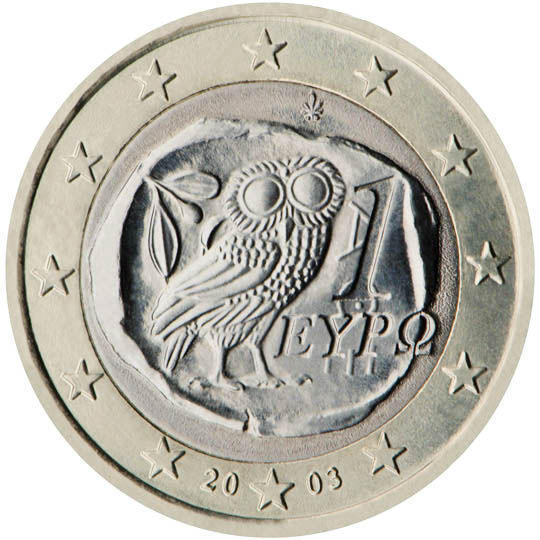

# Greece € 1.00

## Images

## Metadata

**Country:** [Greece](../index.md)\
**Serie:** [Greece 2002 - ...](index.md)\
**Monetary value:** € 1.00\
**Currency:** Euro

## Description

## Mintages

| Year | Mintmark | Circulated | Brilliant Uncirculated | Proof |
| ---- | -------- | ---------- | ---------------------- | ----- |
| 2002 | S        | 50000000   |                        | 0     |
| 2002 |          | 61500000   | 50000                  | 0     |
| 2003 |          | 11700000   | 99000                  | 0     |
| 2004 |          | 10000000   | 30000                  | 0     |
| 2005 |          | 10000000   | 50000                  | 0     |
| 2006 |          | 10000000   | 50000                  | 0     |
| 2007 |          | 24000000   | 25000                  | 0     |
| 2008 |          | 4000000    | 25000                  | 0     |
| 2009 |          | 18000000   | 20000                  | 0     |
| 2010 |          | 11000000   | 25000                  | 0     |
| 2011 |          | 1000000    | 35000                  | 2500  |
| 2012 |          | 0          | 30000                  | 2500  |
| 2013 |          | 0          | 20000                  | 4000  |
| 2014 |          | 0          | 13000                  | 2500  |
| 2015 |          | 0          | 15000                  | 2000  |
| 2016 |          | 0          | 15000                  | 2000  |
| 2017 |          | 0          | 15000                  | 1200  |
| 2018 |          | 0          | 15000                  | 2000  |
| 2019 |          | 0          | 10000                  | 1500  |
| 2020 |          | 0          | 10000                  | 0     |
| 2021 |          | 0          | 10000                  | 0     |
| 2022 |          | 0          | 7500                   | 0     |
| 2023 |          | 0          | 7500                   | 0     |
| 2024 |          | 0          | 0                      | 0     |
