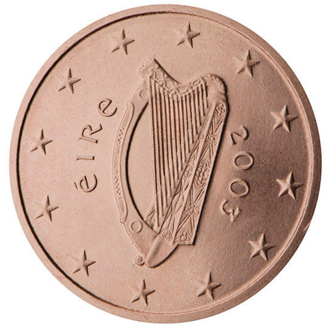

# Ireland € 0.02

## Images

## Metadata

**Country:** [Ireland](../index.md)\
**Serie:** [Ireland 2002 - ...](index.md)\
**Monetary value:** € 0.02\
**Currency:** Euro

## Description

Celtic Harp

## Mintages

| Year | Mintmark | Circulated | Brilliant Uncirculated | Proof |
| ---- | -------- | ---------- | ---------------------- | ----- |
| 2002 |          | 355410000  | 20000                  |       |
| 2003 |          | 177355000  | 65000                  |       |
| 2004 |          | 143040000  | 40000                  |       |
| 2005 |          | 74700000   | 50000                  |       |
| 2006 |          | 26625000   | 75000                  | 5000  |
| 2007 |          | 200980000  | 40000                  | 10000 |
| 2008 |          | 35830000   | 30000                  |       |
| 2009 |          | 44275000   | 25000                  | 5000  |
| 2010 |          | 3480000    | 20000                  |       |
| 2011 |          | 4720000    | 20000                  |       |
| 2012 |          | 11927000   | 17000                  | 5000  |
| 2013 |          | 34814000   | 15000                  |       |
| 2014 |          | 3124000    | 12000                  |       |
| 2015 |          | 50000      | 10000                  | 1000  |
| 2016 |          | 210000     | 50000                  | 4000  |
| 2017 |          | 17120      | 8000                   |       |
| 2018 |          | 25990      | 6000                   |       |
| 2019 |          | 8000       | 8000                   | 1000  |
| 2020 |          | 8000       | 8000                   |       |
| 2021 |          | 0          | 6000                   | 0     |
| 2022 |          | 0          | 9000                   | 0     |
| 2023 |          | 0          | 7000                   | 1000  |
| 2024 |          | 0          | 5000                   | 1000  |
| 2025 |          | 0          | 0                      | 0     |
| 2026 |          | 0          | 0                      | 0     |
