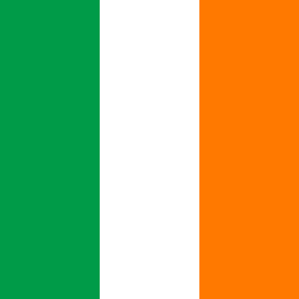

# Ireland

## Metadata

**Isocode:** IE

## Description

Ireland is a country on the island of the same name. The Atlantic Ocean lies to the west of the island. Ireland has been paying with the euro since 2002.

## Images

