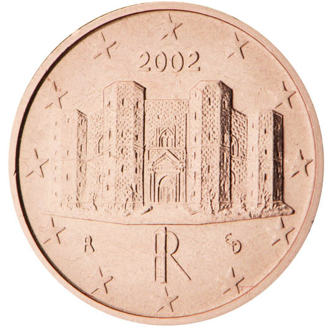

# Italy € 0.01

## Images

## Metadata

**Country:** [Italy](../index.md)\
**Serie:** [Italy 2002 - ...](index.md)\
**Monetary value:** € 0.01\
**Currency:** Euro

## Description

## Mintages

| Year | Mintmark | Circulated | Brilliant Uncirculated | Proof |
| ---- | -------- | ---------- | ---------------------- | ----- |
| 2002 |  | 0| 150000 |  |
| 2003 |  | 0| 100000 | 12000 |
| 2004 |  | 0| 65000 | 10000 |
| 2005 |  | 0| 49500 | 6600 |
| 2006 |  | 0| 42500 | 5800 |
| 2007 |  | 0| 39000 | 5510 |
| 2008 |  | 0| 38600 | 5000 |
| 2009 |  | 0| 40600 | 5500 |
| 2010 |  | 0| 38000 | 5000 |
| 2011 |  | 0| 36500 | 5500 |
| 2012 |  | 0| 28000 | 3990 |
| 2013 |  | 0| 22000 | 2820 |
| 2014 |  | 0| 21600 | 3090 |
| 2015 |  | 0| 23000 | 2340 |
| 2016 |  | 0| 19400 | 2040 |
| 2017 |  | 0| 21000 | 3000 |
| 2018 |  | 0| 20000 | 2000 |
| 2019 |  | 0| 20000 | 2000 |
| 2020 |  | 0| 12000 | 0 |
| 2021 |  | 0 | 0 | 0 |
| 2022 |  | 0 | 0 | 0 |
| 2023 |  | 0 | 0 | 0 |
| 2024 |  | 0 | 0 | 0 |
