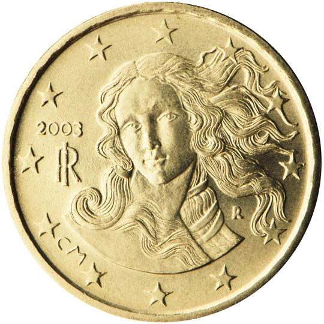

# Italy € 0.10

## Images

## Metadata

**Country:** [Italy](../index.md)\
**Serie:** [Italy 2002 - ...](index.md)\
**Monetary value:** € 0.10\
**Currency:** Euro

## Description

The Birth of Venus by Botticelli

## Mintages

| Year | Mintmark | Circulated | Brilliant Uncirculated | Proof |
| ---- | -------- | ---------- | ---------------------- | ----- |
| 2002 |          | 1142233000 | 150000                 |       |
| 2003 |          | 29826000   | 100000                 | 12000 |
| 2004 |          | 5000000    | 65000                  | 10000 |
| 2005 |          | 100000000  | 49000                  | 6600  |
| 2006 |          | 180000000  | 42000                  | 5800  |
| 2007 |          | 105000000  | 39000                  | 5500  |
| 2008 |          | 105000000  | 38000                  | 5000  |
| 2009 |          | 106000000  | 40000                  | 5500  |
| 2010 |          | 91350000   | 38000                  | 5000  |
| 2011 |          | 76000000   | 36500                  | 5500  |
| 2012 |          | 100000000  | 28000                  | 4000  |
| 2013 |          | 15000000   | 22000                  | 2800  |
| 2014 |          | 10000000   | 21000                  | 3000  |
| 2015 |          | 10000000   | 23000                  | 2300  |
| 2016 |          | 15000000   | 19300                  | 2000  |
| 2017 |          | 40000000   | 21000                  | 3000  |
| 2018 |          | 95000000   | 20000                  | 3000  |
| 2019 |          | 110000000  | 40000                  | 2000  |
| 2020 |          | 45000000   | 22000                  | 2000  |
| 2021 |          | 59982000   | 16000                  | 1500  |
| 2022 |          | 0          | 18000                  | 2500  |
| 2023 |          | 0          | 16000                  | 1500  |
| 2024 |          | 0          | 15000                  | 4000  |
| 2025 |          | 0          | 0                      | 0     |
| 2026 |          | 0          | 0                      | 0     |
