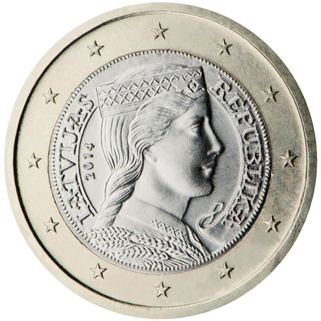

# Latvia € 1.00

## Images

## Metadata

**Country:** [Latvia](../index.md)\
**Serie:** [Latvia 2014 - ...](index.md)\
**Monetary value:** € 1.00\
**Currency:** Euro

## Description

## Mintages

| Year | Mintmark | Circulated | Brilliant Uncirculated | Proof |
| ---- | -------- | ---------- | ---------------------- | ----- |
| 2014 |          | 30000000   | 30000                  | 5000  |
| 2015 |          | 0          | 25000                  | 5000  |
| 2016 |          | 10000000   | 5000                   |       |
| 2017 |          |            |                        |       |
| 2018 |          | 0          | 7000                   |       |
| 2019 |          | 0          | 7000                   |       |
| 2020 |          | 0          | 7000                   |       |
| 2021 |          | 0          | 0                      | 0     |
| 2022 |          | 0          | 0                      | 0     |
| 2023 |          | 0          | 0                      | 0     |
| 2024 |          | 0          | 0                      | 0     |
