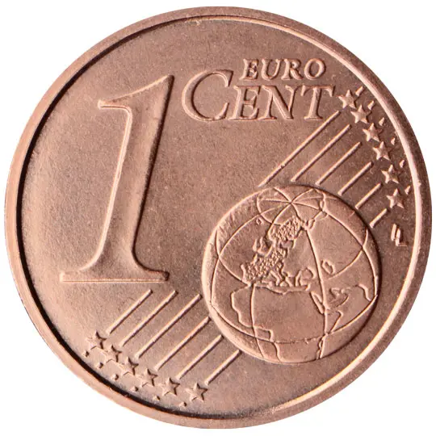
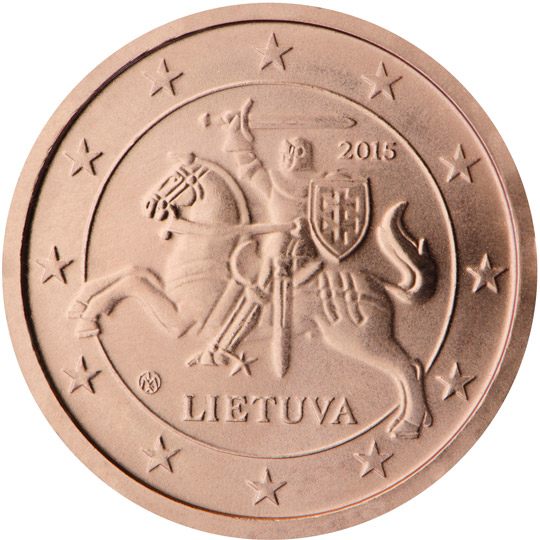

# Lithuania € 0.01

## Images

## Metadata

**Country:** [Lithuania](../index.md)\
**Serie:** [Lithuania 2015 - ...](index.md)\
**Monetary value:** € 0.01\
**Currency:** Euro

## Description

## Mintages

| Year | Mintmark | Circulated | Brilliant Uncirculated | Proof |
| ---- | -------- | ---------- | ---------------------- | ----- |
| 2015 |  | 70000000| 35000 | 7000 |
| 2016 |  | 20000000|  |  |
| 2017 |  | 22000000|  |  |
| 2018 |  | 0| 5000 |  |
| 2019 |  | 0| 6000 |  |
| 2020 |  | 0| 6000 |  |
| 2021 |  | 0 | 0 | 0 |
| 2022 |  | 0 | 0 | 0 |
| 2023 |  | 0 | 0 | 0 |
| 2024 |  | 0 | 0 | 0 |
