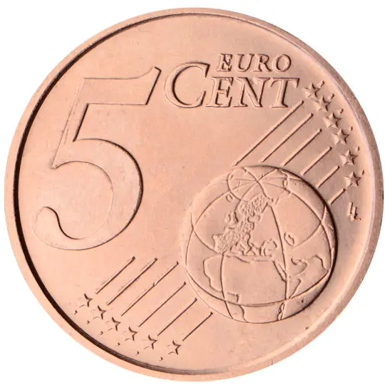
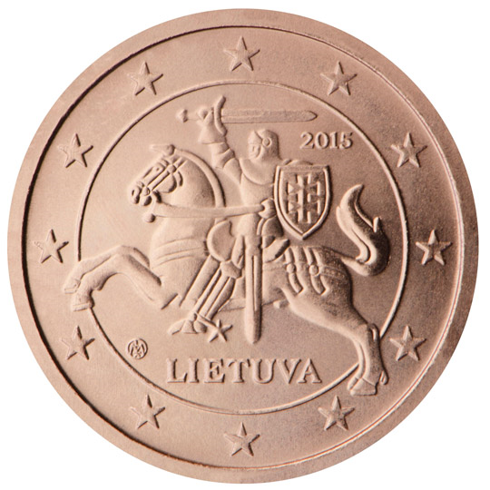

# Lithuania € 0.05

## Images

## Metadata

**Country:** [Lithuania](../index.md)\
**Serie:** [Lithuania 2015 - ...](index.md)\
**Monetary value:** € 0.05\
**Currency:** Euro

## Description

## Mintages

| Year | Mintmark | Circulated | Brilliant Uncirculated | Proof |
| ---- | -------- | ---------- | ---------------------- | ----- |
| 2015 |          | 60000000   | 35000                  | 7000  |
| 2018 |          | 0          | 5000                   | 0     |
| 2019 |          | 0          | 6000                   | 0     |
| 2020 |          | 0          | 6000                   | 0     |
| 2021 |          | 0          | 6000                   | 0     |
| 2022 |          | 2000000    | 7000                   | 0     |
| 2023 |          | 8000000    | 7000                   | 0     |
| 2024 |          | 0          | 0                      | 0     |
