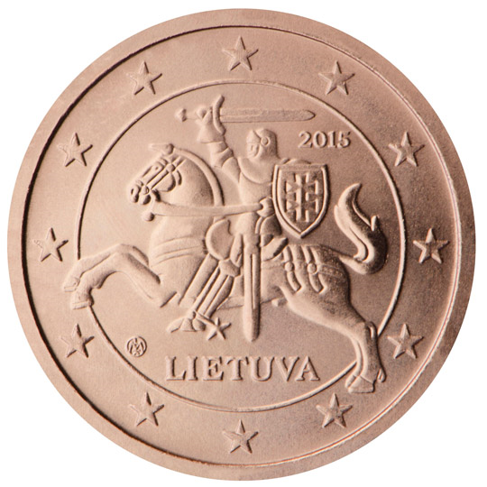

# Lithuania € 0.05

## Images

## Metadata

**Country:** [Lithuania](../index.md)\
**Serie:** [Lithuania 2015 - ...](index.md)\
**Monetary value:** € 0.05\
**Currency:** Euro\
**Designer:** Antanas Žukauskas

## Description

"Vytis" in the coat of arms of Lithuania

## Mintages

| Year | Mintmark | Circulated | Brilliant Uncirculated | Proof |
| ---- | -------- | ---------- | ---------------------- | ----- |
| 2015 |          | 60000000   | 35000                  | 7000  |
| 2018 |          | 0          | 5000                   | 0     |
| 2019 |          | 0          | 6000                   | 0     |
| 2020 |          | 0          | 6000                   | 0     |
| 2021 |          | 0          | 6000                   | 0     |
| 2022 |          | 2000000    | 7000                   | 0     |
| 2023 |          | 8000000    | 7000                   | 0     |
| 2024 |          | 9000000    | 7000                   | 0     |
| 2025 |          | 0          | 7000                   | 0     |
| 2026 |          | 0          | 6000                   | 0     |

### Sources

- [Mintages 2026](https://www.lb.lt/en/collector-and-commemorative-coins-2/numismatic-set-of-euro-circulation-coins-2026-issue)
- [Mintages 2025](https://www.lb.lt/en/collector-and-commemorative-coins-2/numismatic-set-of-euro-circulation-coins-2025-issue)
- [Mintages 2024 (BU)](https://www.lb.lt/en/collector-and-commemorative-coins-2/numismatic-set-of-euro-circulation-coins-2024-issue)
- [Mintages 2023 (BU)](https://www.lb.lt/en/collector-and-commemorative-coins-2/numismatic-set-of-euro-circulation-coins-2023-issue)
- [Mintages 2022 (BU)](https://www.lb.lt/en/collector-and-commemorative-coins-2/numismatic-set-of-euro-circulation-coins-2022-issue)
- [Mintages 2021](https://www.lb.lt/en/collector-and-commemorative-coins-2/numismatic-set-of-euro-circulation-coins-2021-issue)
- [Designer](https://www.lb.lt/en/news/the-board-of-the-bank-of-lithuania-made-the-historical-decision-regarding-the-national-side-of-the-euro)
