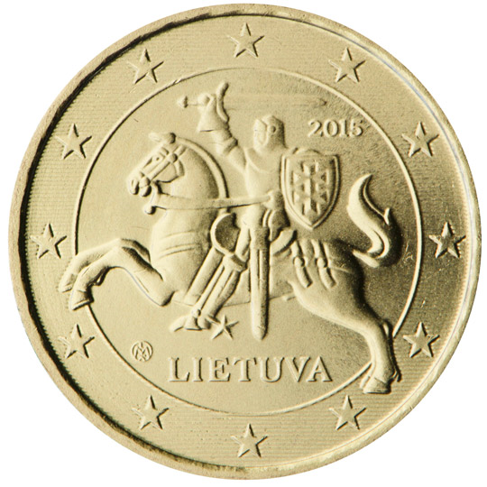

# Lithuania € 0.10

## Images

## Metadata

**Country:** [Lithuania](../index.md)\
**Serie:** [Lithuania 2015 - ...](index.md)\
**Monetary value:** € 0.10\
**Currency:** Euro

## Description

"Vytis" in the coat of arms of Lithuania

## Mintages

| Year | Mintmark | Circulated | Brilliant Uncirculated | Proof |
| ---- | -------- | ---------- | ---------------------- | ----- |
| 2015 |          | 35000000   | 35000                  | 7000  |
| 2017 |          | 14000000   | 0                      | 0     |
| 2018 |          | 0          | 5000                   | 0     |
| 2019 |          | 0          | 6000                   | 0     |
| 2020 |          | 0          | 6000                   | 0     |
| 2021 |          | 0          | 6000                   | 0     |
| 2022 |          | 0          | 7000                   | 0     |
| 2023 |          | 5000000    | 7000                   | 0     |
| 2024 |          | 0          | 7000                   | 0     |
| 2025 |          | 0          | 7000                   | 0     |
| 2026 |          | 0          | 0                      | 0     |
