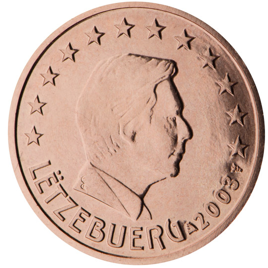

# Luxembourg € 0.05

## Images

## Metadata

**Country:** [Luxembourg](../index.md)\
**Serie:** [Luxembourg 2002 - 2026](index.md)\
**Monetary value:** € 0.05\
**Currency:** Euro

## Description

Grand Duke Henri

## Mintages

| Year | Mintmark | Circulated | Brilliant Uncirculated | Proof |
| ---- | -------- | ---------- | ---------------------- | ----- |
| 2002 |          | 28917000   | 40000                  | 1500  |
| 2003 |          | 4500000    | 50000                  | 1500  |
| 2004 |          | 16001000   | 20000                  | 1500  |
| 2005 |          | 6000000    | 15000                  | 1500  |
| 2006 |          | 5000000    | 13000                  | 2000  |
| 2007 |          | 5000000    | 11000                  | 2500  |
| 2008 |          | 9000000    | 10000                  | 2000  |
| 2009 |          | 6000000    | 10000                  | 2000  |
| 2010 |          | 6000000    | 7500                   | 1500  |
| 2011 |          | 6700000    | 7500                   | 1500  |
| 2012 |          | 5200000    | 7500                   | 2000  |
| 2013 |          | 7100000    | 7500                   | 2000  |
| 2014 |          | 10000000   | 7500                   | 2000  |
| 2015 |          | 6000000    | 6000                   | 1500  |
| 2016 |          | 6000000    | 6000                   | 1500  |
| 2017 |          | 50000      | 5000                   | 1000  |
| 2018 |          | 1450000    | 5000                   | 1000  |
| 2019 |          | 50000      | 5000                   | 1000  |
| 2020 |          | 2005000    | 45000                  | 5000  |
| 2021 |          | 3050000    | 5000                   | 1000  |
| 2022 |          | 3050000    | 5000                   | 1000  |
| 2023 |          | 5950000    | 5000                   | 0     |
| 2024 |          | 2050000    | 5000                   | 1000  |
| 2025 |          | 0          | 0                      | 0     |
