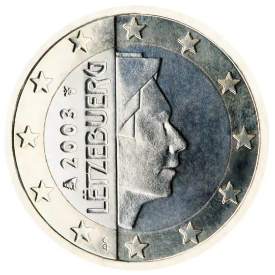

# Luxembourg € 1.00

## Images

## Metadata

**Country:** [Luxembourg](../index.md)\
**Serie:** [Luxembourg 2002 - 2026](index.md)\
**Monetary value:** € 1.00\
**Currency:** Euro

## Description

Grand Duke Henri

## Mintages

| Year | Mintmark | Circulated | Brilliant Uncirculated | Proof |
| ---- | -------- | ---------- | ---------------------- | ----- |
| 2002 |          | 21318000   | 40000                  | 1500  |
| 2003 |          | 1500000    | 50000                  | 1500  |
| 2004 |          | 9001000    | 20000                  | 1500  |
| 2005 |          | 2000000    | 15000                  | 1500  |
| 2006 |          | 1000000    | 13000                  | 2000  |
| 2007 |          | 480000     | 11000                  | 2500  |
| 2008 |          | 480000     | 10000                  | 2000  |
| 2009 |          | 240000     | 10000                  | 2000  |
| 2010 |          | 1000000    | 7500                   | 1500  |
| 2011 |          | 1520000    | 7500                   | 1500  |
| 2012 |          | 2240000    | 7500                   | 2000  |
| 2013 |          | 3320000    | 7500                   | 2000  |
| 2014 |          | 5000000    | 7500                   | 2000  |
| 2015 |          | 1000000    | 6000                   | 1500  |
| 2016 |          | 1000000    | 6000                   | 1500  |
| 2017 |          | 50000      | 5000                   | 1000  |
| 2018 |          | 50000      | 5000                   | 1000  |
| 2019 |          | 50000      | 5000                   | 1000  |
| 2020 |          | 50000      | 45000                  | 5000  |
| 2021 |          | 50000      | 5000                   | 1000  |
| 2022 |          | 50000      | 5000                   | 1000  |
| 2023 |          | 4050000    | 5000                   | 0     |
| 2024 |          | 3050000    | 5000                   | 1000  |
| 2025 |          | 0          | 0                      | 0     |
