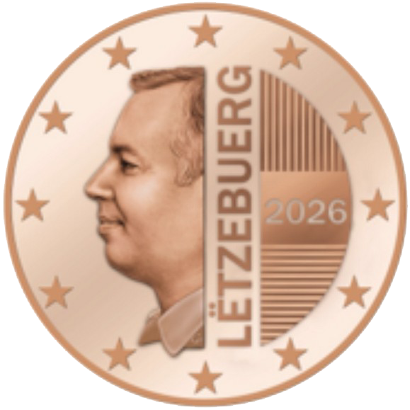

# Luxembourg € 0.05

## Images

## Metadata

**Country:** [Luxembourg](../index.md)\
**Serie:** [Luxembourg 2026 - ...](index.md)\
**Monetary value:** € 0.05\
**Currency:** Euro\
**Issue date:** 2026-07-13\
**Designer:** Chiara Principe

## Description

Grand Duke Guillaume

## Mintages

| Year | Mintmark | Circulated | Brilliant Uncirculated | Proof |
| ---- | -------- | ---------- | ---------------------- | ----- |
| 2026 |          | 1300000    | 0                      |    0  |

### Sources

- [Mintages](https://www.bcl.lu/fr/Billets-et-pieces/billets_pieces/car_pieces/Les-pieces-en-euros-depuis-2026/PDF-brochure_nouvelles_pieces_BCL.pdf)
- [Issue date](https://today.rtl.lu/news/luxembourg/luxembourg-unveils-new-coins-featuring-grand-duke-guillaume-1863471379)
- [Designer](https://www.luxtimes.lu/luxembourg/grand-duke-guillaume-to-feature-on-freshly-minted-euro-coins/154777598.html)
