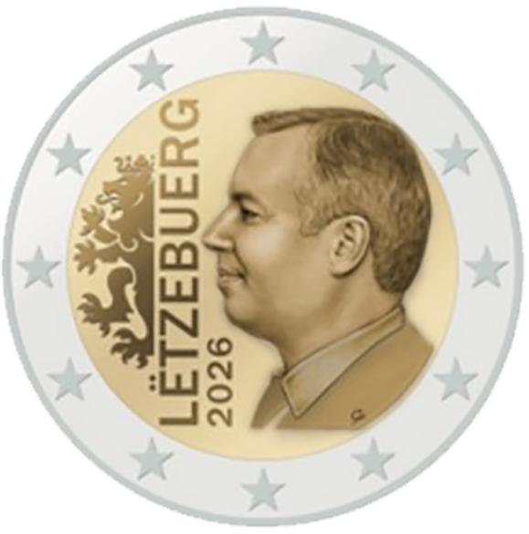

# Luxembourg € 2.00

## Images

## Metadata

**Country:** [Luxembourg](../index.md)\
**Serie:** [Luxembourg 2026 - ...](index.md)\
**Monetary value:** € 2.00\
**Currency:** Euro

## Description

Grand Duke Guillaume

## Mintages

| Year | Mintmark | Circulated | Brilliant Uncirculated | Proof |
| ---- | -------- | ---------- | ---------------------- | ----- |
| 2026 |          | 0          | 0                      |    0  |
