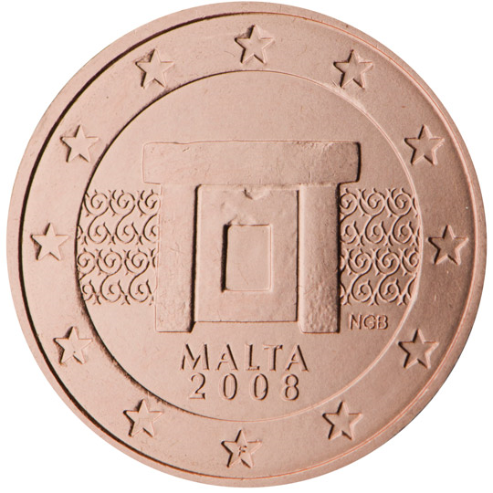

# Malta € 0.02

## Images

## Metadata

**Country:** [Malta](../index.md)\
**Serie:** [Malta 2008 - ...](index.md)\
**Monetary value:** € 0.02\
**Currency:** Euro

## Description

## Mintages

| Year | Mintmark | Circulated | Brilliant Uncirculated | Proof |
| ---- | -------- | ---------- | ---------------------- | ----- |
| 2008 |  | 36000000| 40000 |  |
| 2011 |  | 0| 50000 |  |
| 2012 |  | 0| 50000 |  |
| 2013 |  | 3040000| 35000 |  |
| 2014 |  | 0| 25000 |  |
| 2015 |  | 0| 30000 |  |
| 2016 |  | 0| 35000 |  |
| 2017 |  | 0| 30000 |  |
| 2018 |  | 0| 17000 |  |
| 2019 |  | 0| 15000 |  |
| 2020 |  | 0| 10000 |  |
| 2021 |  | 0 | 0 | 0 |
| 2022 |  | 0 | 0 | 0 |
| 2023 |  | 0 | 0 | 0 |
| 2024 |  | 0 | 0 | 0 |
