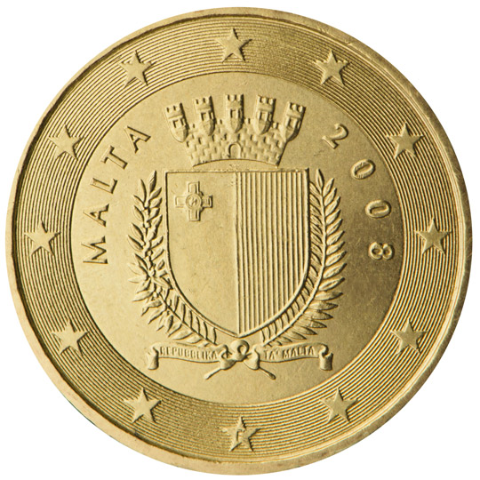

# Malta € 0.10

## Images

## Metadata

**Country:** [Malta](../index.md)\
**Serie:** [Malta 2008 - ...](index.md)\
**Monetary value:** € 0.10\
**Currency:** Euro\
**Designer:** Noel Galea Bason

## Description

National coat of arms of Malta

## Mintages

| Year | Mintmark | Circulated | Brilliant Uncirculated | Proof |
| ---- | -------- | ---------- | ---------------------- | ----- |
| 2008 |          | 41000000   | 40000                  | 0     |
| 2011 |          | 0          | 50000                  | 0     |
| 2012 |          | 0          | 50000                  | 0     |
| 2013 |          | 0          | 35000                  | 0     |
| 2014 |          | 0          | 25000                  | 0     |
| 2015 |          | 0          | 30000                  | 0     |
| 2016 |          | 0          | 35000                  | 0     |
| 2017 |          | 0          | 30000                  | 0     |
| 2018 |          | 0          | 17000                  | 0     |
| 2019 |          | 0          | 15000                  | 0     |
| 2020 |          | 0          | 10000                  | 0     |
| 2021 |          | 0          | 10000                  | 0     |
| 2022 |          | 1110000    | 11000                  | 0     |
| 2023 |          | 2300000    | 20000                  | 0     |
| 2024 |          | 0          | 10000                  | 0     |
| 2025 |          | 0          | 0                      | 0     |
| 2026 |          | 0          | 0                      | 0     |
