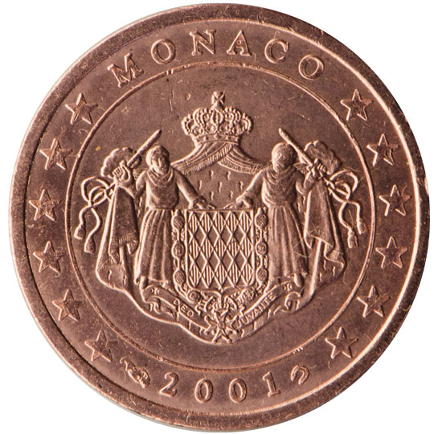

# Monaco € 0.02

## Images

## Metadata

**Country:** [Monaco](../index.md)\
**Serie:** [Monaco 2001 - 2006](index.md)\
**Monetary value:** € 0.02\
**Currency:** Euro

## Description

## Mintages

| Year | Mintmark | Circulated | Brilliant Uncirculated | Proof |
| ---- | -------- | ---------- | ---------------------- | ----- |
| 2001 |  | 396900| 20000 | 3500 |
| 2002 |  | 0| 40000 |  |
| 2003 |  | |  |  |
| 2004 |  | 0|  | 14999 |
| 2005 |  | 0|  | 35000 |
