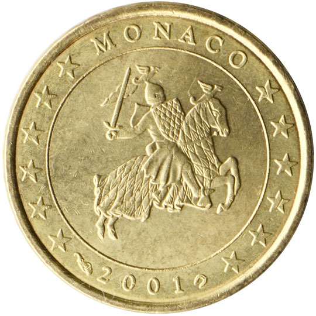

# Monaco € 0.20

## Images

## Metadata

**Country:** [Monaco](../index.md)\
**Serie:** [Monaco 2001 - 2006](index.md)\
**Monetary value:** € 0.20\
**Currency:** Euro

## Description

## Mintages

| Year | Mintmark | Circulated | Brilliant Uncirculated | Proof |
| ---- | -------- | ---------- | ---------------------- | ----- |
| 2001 |          | 389900     | 20000                  | 3500  |
| 2002 |          | 376000     | 40000                  |       |
| 2003 |          | 100000     |                        |       |
| 2004 |          | 0          |                        | 14999 |
| 2005 |          |            |                        |       |
