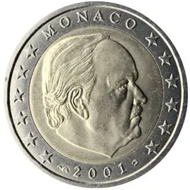

# Monaco € 2.00

## Images

## Metadata

**Country:** [Monaco](../index.md)\
**Serie:** [Monaco 2001 - 2006](index.md)\
**Monetary value:** € 2.00\
**Currency:** Euro

## Description

Portrait of Prince Rainier III

## Mintages

| Year | Mintmark | Circulated | Brilliant Uncirculated | Proof |
| ---- | -------- | ---------- | ---------------------- | ----- |
| 2001 |          | 923300     | 20000                  | 3500  |
| 2002 |          | 496000     | 40000                  | 0     |
| 2003 |          | 228000     | 0                      | 0     |
| 2004 |          | 0          | 0                      | 14900 |
| 2005 |          | 0          | 0                      | 35000 |
