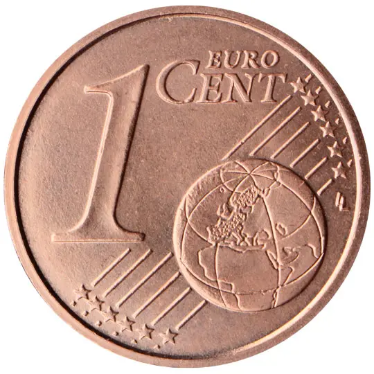
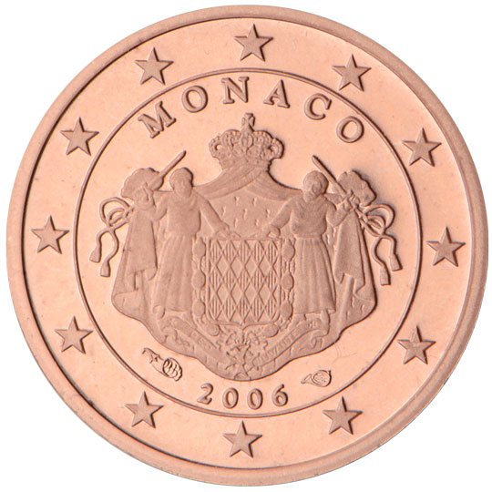

# Monaco € 0.01

## Images

## Metadata

**Country:** [Monaco](../index.md)\
**Serie:** [Monaco 2006 - ...](index.md)\
**Monetary value:** € 0.01\
**Currency:** Euro

## Description

## Mintages

| Year | Mintmark | Circulated | Brilliant Uncirculated | Proof |
| ---- | -------- | ---------- | ---------------------- | ----- |
| 2006 |          | 0          | 0                      | 11100 |
| 2009 |          | 0          | 8000                   | 0     |
| 2011 |          | 0          | 7000                   | 0     |
| 2013 |          | 0          | 10000                  | 0     |
| 2014 |          | 0          | 8000                   | 0     |
| 2017 |          | 0          | 8000                   | 0     |
| 2020 |          | 0          | 7000                   | 0     |
| 2021 |          | 0          | 0                      | 0     |
| 2022 |          | 0          | 0                      | 0     |
| 2023 |          | 0          | 0                      | 0     |
| 2024 |          | 0          | 0                      | 0     |
