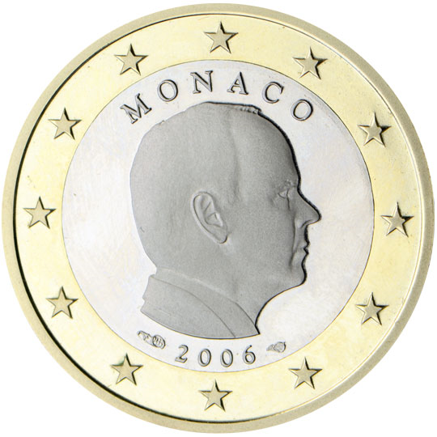

# Monaco € 1.00

## Images

## Metadata

**Country:** [Monaco](../index.md)\
**Serie:** [Monaco 2006 - ...](index.md)\
**Monetary value:** € 1.00\
**Currency:** Euro

## Description

## Mintages

| Year | Mintmark | Circulated | Brilliant Uncirculated | Proof |
| ---- | -------- | ---------- | ---------------------- | ----- |
| 2006 |  | 0|  | 11180 |
| 2007 |  | 100000|  |  |
| 2008 |  | |  |  |
| 2009 |  | 0| 8000 |  |
| 2010 |  | |  |  |
| 2011 |  | 0| 7000 |  |
| 2012 |  | |  |  |
| 2013 |  | 0| 10000 |  |
| 2014 |  | 1008272| 8000 |  |
| 2015 |  | |  |  |
| 2016 |  | 1000000|  |  |
| 2017 |  | 0| 8000 |  |
| 2018 |  | 1000000|  |  |
| 2019 |  | 550000|  |  |
| 2020 |  | 1087017| 7000 |  |
