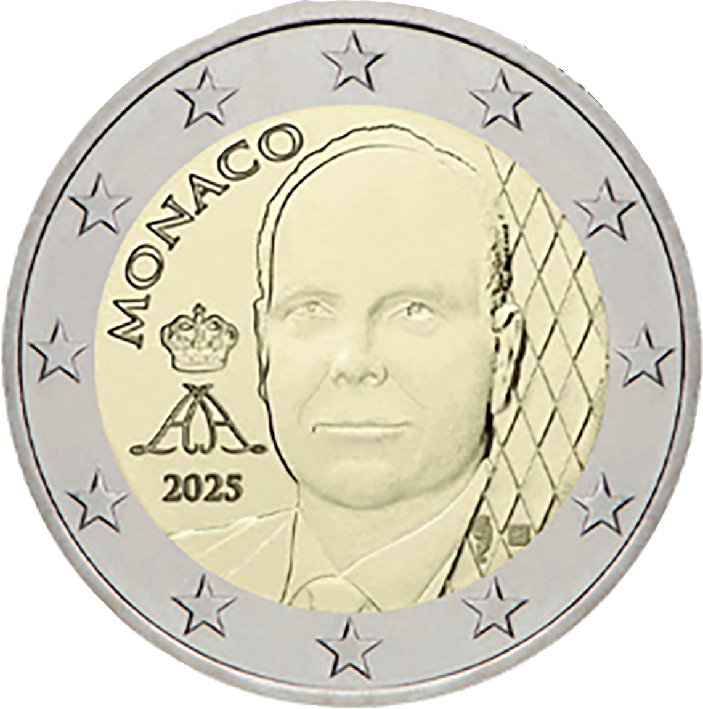

# Monaco € 2.00

## Images

## Metadata

**Country:** [Monaco](../index.md)\
**Serie:** [Monaco 2025 - ...](index.md)\
**Monetary value:** € 2.00\
**Currency:** Euro\
**Designer:** Joaquin Jimenez

## Description

Portrait of Prince Albert II

## Mintages

| Year | Mintmark | Circulated | Brilliant Uncirculated | Proof |
| ---- | -------- | ---------- | ---------------------- | ----- |
| 2025 |          | 0          | 0                      | 0     |
| 2026 |          | 0          | 0                      | 0     |
