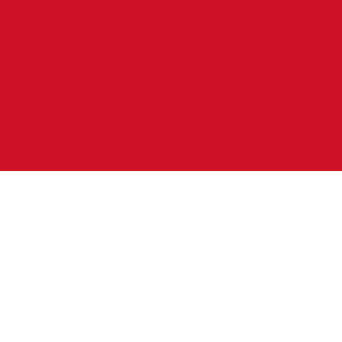

# Monaco

## Metadata

**Isocode:** MC

## Description

Monaco is a tiny city-state located on the Mediterranean Sea. On the landward side, the country is completely enclosed by France. Monaco has been paying with the euro since 2002.

## Images

