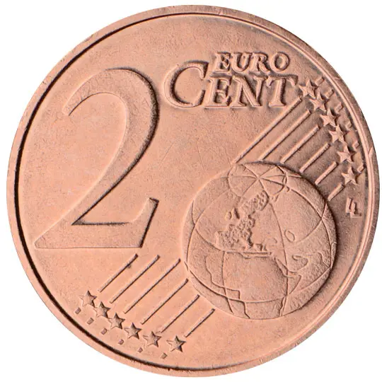
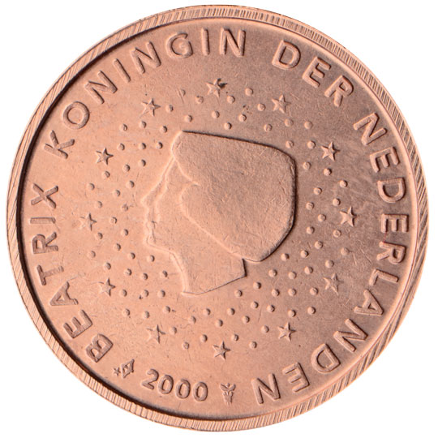

# Netherlands € 0.02

## Images

## Metadata

**Country:** [Netherlands](../index.md)\
**Serie:** [Netherlands 1999 - 2014](index.md)\
**Monetary value:** € 0.02\
**Currency:** Euro

## Description

## Mintages

| Year | Mintmark | Circulated | Brilliant Uncirculated | Proof |
| ---- | -------- | ---------- | ---------------------- | ----- |
| 1999 |          | 109000000  | 100000                 | 16500 |
| 2000 |          | 122000000  | 108000                 | 16500 |
| 2001 |          | 145800000  | 95000                  | 16500 |
| 2002 |          | 53100000   | 170000                 | 16500 |
| 2003 |          | 151200000  | 115000                 | 11000 |
| 2004 |          | 115700000  | 80000                  | 5000  |
| 2005 |          | 400000     | 80000                  | 5000  |
| 2006 |          | 200000     | 45000                  | 3500  |
| 2007 |          | 200000     | 40000                  | 7000  |
| 2008 |          | 200000     | 40000                  | 7597  |
| 2009 |          | 200000     | 35000                  | 5000  |
| 2010 |          | 200000     | 25000                  | 5000  |
| 2011 |          | 300000     | 25000                  | 5000  |
| 2012 |          | 200000     | 15000                  | 5000  |
| 2013 |          | 200000     | 45000                  | 5000  |
