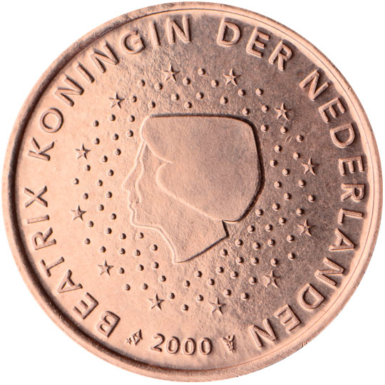

# Netherlands € 0.05

## Images

## Metadata

**Country:** [Netherlands](../index.md)\
**Serie:** [Netherlands 1999 - 2014](index.md)\
**Monetary value:** € 0.05\
**Currency:** Euro

## Description

## Mintages

| Year | Mintmark | Circulated | Brilliant Uncirculated | Proof |
| ---- | -------- | ---------- | ---------------------- | ----- |
| 1999 |  | 0| 65000 | 16500 |
| 2000 |  | 0| 68000 | 16500 |
| 2001 |  | 0| 65000 | 16500 |
| 2002 |  | 0| 140000 | 16500 |
| 2003 |  | 0| 115000 | 11000 |
| 2004 |  | 0| 80000 | 5000 |
| 2005 |  | 0| 80000 | 5000 |
| 2006 |  | 0| 45000 | 3500 |
| 2007 |  | 0| 40000 | 7000 |
| 2008 |  | 0| 40000 | 7597 |
| 2009 |  | 0| 35000 | 5000 |
| 2010 |  | 0| 25000 | 5000 |
| 2011 |  | 0| 25000 | 5000 |
| 2012 |  | 0| 15000 | 5000 |
| 2013 |  | 0| 35000 | 5000 |
