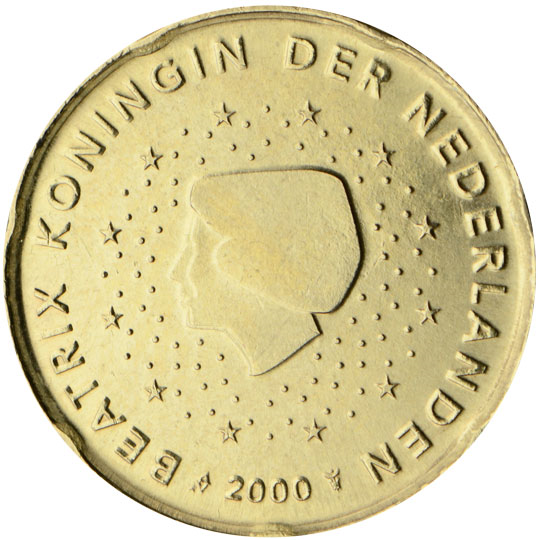

# Netherlands € 0.20

## Images

## Metadata

**Country:** [Netherlands](../index.md)\
**Serie:** [Netherlands 1999 - 2014](index.md)\
**Monetary value:** € 0.20\
**Currency:** Euro

## Description

## Mintages

| Year | Mintmark | Circulated | Brilliant Uncirculated | Proof |
| ---- | -------- | ---------- | ---------------------- | ----- |
| 1999 |          | 86500000   | 65000                  | 16000 |
| 2000 |          | 67500000   | 68000                  | 16500 |
| 2001 |          | 97600000   | 65000                  | 16500 |
| 2002 |          | 51200000   | 212852                 | 16000 |
| 2003 |          | 58200000   | 179003                 | 12000 |
| 2004 |          | 20500000   | 100004                 | 5000  |
| 2005 |          | 0          | 91500                  | 6000  |
| 2006 |          | 0          | 54506                  | 5000  |
| 2007 |          | 0          | 54507                  | 7000  |
| 2008 |          | 0          | 51008                  | 7500  |
| 2009 |          | 0          | 46509                  | 7500  |
| 2010 |          | 0          | 40510                  | 5000  |
| 2011 |          | 0          | 41761                  | 5000  |
| 2012 |          | 0          | 50512                  | 5000  |
| 2013 |          | 0          | 39263                  | 5000  |
